Bulk RNA-Sequencing analysis of PDGFRA/YFP+ HD model GPCs
================
John Mariani
4/17/2022

<style>
    body .main-container {
        max-width: 1500px;
    }
</style>

## Import of Mouse Data

\#Read in RSEM gene output

``` r
# Run in R 3.6.1
library(readr)
library(tximport)
library(DESeq2)
library(biomaRt)
library(gplots)
library(stringr)
library(patchwork)
library(ggfortify)
library(ggplot2)
#library(ggupset)
library(data.table)
library(plyr)
library(dplyr)
library(ggVennDiagram)
library(tidyr)
library(xlsx)
library(Hmisc)
library(ggrepel)
library(EnhancedVolcano)
library(plyr)
library(tidyr)
library(patchwork)
library(Hmisc)
library(ggVennDiagram)
library(ggplotify)
library(ggfortify)
```

``` r
#Read in RSEM gene output
temp = list.files(path = "./data_for_import/rsemGenes", pattern="genes.results")

names(temp) <- substr(temp,1,nchar(temp)-14)
names(temp)
```

    ##  [1] "12WK-R62-1A_RSEM" "12WK-R62-2A_RSEM" "12WK-R62-3A_RSEM" "12WK-R62-4A_RSEM"
    ##  [5] "12WK-R62-5A_RSEM" "12WK-R62-6A_RSEM" "12WK-R62-7A_RSEM" "12WK-WT_1A_RSEM" 
    ##  [9] "12WK-WT_2A_RSEM"  "12WK-WT_3A_RSEM"  "12WK-WT_4A_RSEM"  "12WK-WT_5A_RSEM" 
    ## [13] "12WK-WT_6A_RSEM"  "12WK-WT_7A_RSEM"  "1Y_Q175_2_RSEM"   "1Y_Q175_3_RSEM"  
    ## [17] "1Y_Q175_4_RSEM"   "1Y_Q175_5_RSEM"   "1Y_Q175_6_RSEM"   "1Y_WT_2_RSEM"    
    ## [21] "1Y_WT_3_RSEM"     "1Y_WT_4_RSEM"     "1Y_WT_5_RSEM"     "3M_Q175_1_RSEM"  
    ## [25] "3M_Q175_2_RSEM"   "3M_Q175_3_RSEM"   "3M_Q175_4_RSEM"   "3M_Q175_5_RSEM"  
    ## [29] "3M_Q175_6_RSEM"   "3M_WT_1_RSEM"     "3M_WT_2_RSEM"     "3M_WT_3_RSEM"    
    ## [33] "3M_WT_4_RSEM"     "3M_WT_5_RSEM"     "3M_WT_6_RSEM"     "6WK-R62-1A_RSEM" 
    ## [37] "6WK-R62-2A_RSEM"  "6WK-R62-3A_RSEM"  "6WK-R62-4A_RSEM"  "6WK-R62-5A_RSEM" 
    ## [41] "6WK-R62-6A_RSEM"  "6WK-WT_1A_RSEM"   "6WK-WT_2A_RSEM"   "6WK-WT_3A_RSEM"  
    ## [45] "6WK-WT_4A_RSEM"   "6WK-WT_6A_RSEM"

``` r
names(temp) <- gsub("-", "_", names(temp))
names(temp) <- gsub("A", "", names(temp))
names(temp) <- substr(names(temp),1,nchar(names(temp))-5)
txi.rsem <- tximport(paste0("./data_for_import/rsemGenes/",temp), type = "rsem")


for(i in 1:3){
  colnames(txi.rsem[[i]]) <- names(temp)
}


TPM <- as.data.frame(txi.rsem$abundance)
```

### Load gene annotations from biomaRt

``` r
filename="data_for_import/ensemblGeneListHD_Mouse.csv"
if(file.exists(filename)){
  ensemblGeneListM <- read.csv(filename)} else{
    martm <- useMart(biomart = "ENSEMBL_MART_ENSEMBL", dataset = "mmusculus_gene_ensembl", host = 'http://apr2018.archive.ensembl.org/', ensemblRedirect = T)
    ensemblGeneListM <- getBM(attributes = c("ensembl_gene_id","external_gene_name", "gene_biotype", "description", "percentage_gene_gc_content"), filters = "ensembl_gene_id",values = row.names(txi.rsem$counts), mart = martm)
    write.csv(ensemblGeneListM, filename, row.names = F)
}
```

``` r
sampleTableFull <-data.frame(row.names = names(temp), time = sapply(1:length(temp), function(x) str_split(names(temp), "_")[[x]][1]), strain = sapply(1:length(temp), function(x) str_split(names(temp), "_")[[x]][2]), stringsAsFactors = F)
sampleTableFull$disease <- "HD"
sampleTableFull[sampleTableFull$strain == "WT",]$disease <- "Control"
sampleTableFull$sample <- row.names(sampleTableFull)
sampleTableFull$weeks <- 52
sampleTableFull[sampleTableFull$time == "12WK",]$weeks <- 12
sampleTableFull[sampleTableFull$time == "6WK",]$weeks<- 6
sampleTableFull[sampleTableFull$time == "3M",]$weeks <- 12
sampleTableFull$background <- "R"
sampleTableFull[sampleTableFull$strain == "Q175",]$background <- "Q"
sampleTableFull[sampleTableFull$time %in% c("3M", "1Y"),]$background <- "Q"
sampleTableFull$group <- paste0(sampleTableFull$strain, "_",sampleTableFull$weeks)
sampleTableFull$otherGroup <- paste0(sampleTableFull$strain, "_",sampleTableFull$time)
sampleTableFull$comparison <- paste0(sampleTableFull$strain, "_", sampleTableFull$weeks)

sampleTableFull$comparison
```

    ##  [1] "R62_12"  "R62_12"  "R62_12"  "R62_12"  "R62_12"  "R62_12"  "R62_12" 
    ##  [8] "WT_12"   "WT_12"   "WT_12"   "WT_12"   "WT_12"   "WT_12"   "WT_12"  
    ## [15] "Q175_52" "Q175_52" "Q175_52" "Q175_52" "Q175_52" "WT_52"   "WT_52"  
    ## [22] "WT_52"   "WT_52"   "Q175_12" "Q175_12" "Q175_12" "Q175_12" "Q175_12"
    ## [29] "Q175_12" "WT_12"   "WT_12"   "WT_12"   "WT_12"   "WT_12"   "WT_12"  
    ## [36] "R62_6"   "R62_6"   "R62_6"   "R62_6"   "R62_6"   "R62_6"   "WT_6"   
    ## [43] "WT_6"    "WT_6"    "WT_6"    "WT_6"

``` r
#colorDF <- data.frame(group = unique(sampleTableFull$otherGroup), color = c("red", "blue", "magenta", "turquoise", "darkred", "cadetblue", "maroon", "lightblue"))
colorDF <- data.frame(group = unique(sampleTableFull$comparison), color = c("red", "blue", "purple", "turquoise", "lavender", "darkred", "lightblue"))
colorDF
```

    ##     group     color
    ## 1  R62_12       red
    ## 2   WT_12      blue
    ## 3 Q175_52    purple
    ## 4   WT_52 turquoise
    ## 5 Q175_12  lavender
    ## 6   R62_6   darkred
    ## 7    WT_6 lightblue

``` r
#sampleTableFull$color <- colorDF[match(sampleTableFull$otherGroup, colorDF$group),]$color
sampleTableFull$color <- colorDF[match(sampleTableFull$comparison, colorDF$group),]$color


sampleTableFull$color <- col2hex(sampleTableFull$color)

#write.csv(sampleTableFull, "data_for_import/sampleTableFull.csv")

sampleTableFull <- read.csv("data_for_import/sampleTableFull.csv", row.names = 1)
GEOsamples <- sampleTableFull
GEOsamples$temp <- temp
GEOsamples$nameTemp <- names(temp)
GEOsamples$temp <- gsub("_RSEM.genes.results", "", GEOsamples$temp)
#write.csv(GEOsamples, "GEO/GEOsamples.csv")
```

``` r
#Annotate the abundance dataframe
TPM <- merge(TPM, ensemblGeneListM,by.x=0,by.y="ensembl_gene_id")

txi.rsem.new <- txi.rsem

sampleTableFull$weeks <- factor(sampleTableFull$weeks)

counts <- txi.rsem$counts
#For GEO supplemental
#write.table(counts, "GEO/RSEM_counts.txt", sep = "\t", quote = F)

groupMedian <- function(df,groupName){
  return(rowMedians(df[,colnames(df) %in% sampleTableFull[sampleTableFull$otherGroup == groupName,]$sample]))
}


lowTPM <- data.frame(row.names = ensemblGeneListM$ensembl_gene_id, R62_12WK = groupMedian(txi.rsem.new$abundance, "R62_12WK"),
                     WT_12WK = groupMedian(txi.rsem.new$abundance, "WT_12WK"),
                     Q175_1Y = groupMedian(txi.rsem.new$abundance, "Q175_1Y"),
                     WT_1Y = groupMedian(txi.rsem.new$abundance, "WT_1Y"),
                     R62_6WK = groupMedian(txi.rsem.new$abundance, "R62_6WK"),
                     WT_6WK = groupMedian(txi.rsem.new$abundance, "WT_6WK"),
                     WT_3M = groupMedian(txi.rsem.new$abundance, "WT_3M"),
                     Q175_3M = groupMedian(txi.rsem.new$abundance, "Q175_3M"),
                     external = ensemblGeneListM$external_gene_name)


#Filter out genes that are below a median of 3 estimated counts in both conditions
tpmCutoff <- 1
lowTPMFull <- lowTPM[lowTPM[,1] > tpmCutoff | lowTPM[,2] > tpmCutoff | lowTPM[,3] >tpmCutoff | lowTPM[,4] > tpmCutoff | lowTPM[,5]>tpmCutoff | lowTPM[,6]>tpmCutoff,]
```

## Differential Expression with deSEQ2

``` r
#Set 0 lengths to 1 as a DESeq2 requirement
txi.rsem.new$length[txi.rsem.new$length == 0] <- 1


ddsLRT <- DESeqDataSetFromTximport(txi.rsem.new, sampleTableFull, ~0+background+comparison)
```

    ## using counts and average transcript lengths from tximport

``` r
ddsLRT <- estimateSizeFactors(ddsLRT)
```

    ## using 'avgTxLength' from assays(dds), correcting for library size

``` r
ddsLRT <- estimateDispersions(ddsLRT)
```

    ## gene-wise dispersion estimates

    ## mean-dispersion relationship

    ## final dispersion estimates

``` r
ddsFull <- nbinomWaldTest(ddsLRT)

de <- function(dds, cont){
  temp <- data.frame(results(dds, contrast =cont))
  temp <- merge(temp[temp$padj < 0.01,],ensemblGeneListM,by.x=0,by.y="ensembl_gene_id")
  #temp <- temp[temp$Row.names %in% deLRT$Row.names,]
  temp <- temp[temp$Row.names %in% row.names(lowTPMFull),]
  return(temp[complete.cases(temp) ==T,])
}

dim(txi.rsem.new$counts)
```

    ## [1] 53801    46

``` r
de6WkR62_res <- de(ddsFull, cont=c("comparison", "R62_6", "WT_6"))
de12WkR62_res <- de(ddsFull, cont=c("comparison", "R62_12", "WT_12"))
de12WkQ175_res <- de(ddsFull, cont=c("comparison", "Q175_12", "WT_12"))
de1YQ175_res <- de(ddsFull, cont=c("comparison", "Q175_52", "WT_52"))

#write.table(de6WkR62_res, "output/de6WkR62_res.txt", sep = "\t", quote = F, row.names = F)
#write.table(de12WkR62_res, "output/de12WkR62_res.txt", sep = "\t", quote = F, row.names = F)
#write.table(de12WkQ175_res, "output/de12WkQ175_res.txt", sep = "\t", quote = F, row.names = F)
#write.table(de1YQ175_res, "output/de1YQ175_res.txt", sep = "\t", quote = F, row.names = F)


deAll <- function(dds, cont){
  temp <- data.frame(results(dds, contrast =cont))
  temp <- merge(temp,ensemblGeneListM,by.x=0,by.y="ensembl_gene_id")
  #temp <- temp[temp$Row.names %in% deLRT$Row.names,]
  temp <- temp[temp$Row.names %in% row.names(lowTPMFull),]
  return(temp[complete.cases(temp) ==T,])
}

de6WkR62_all <- deAll(ddsFull, cont=c("comparison", "R62_6", "WT_6"))
de12WkR62_all <- deAll(ddsFull, cont=c("comparison", "R62_12", "WT_12"))
de12WkQ175_all <- deAll(ddsFull, cont=c("comparison", "Q175_12", "WT_12"))
de1YQ175_all <- deAll(ddsFull, cont=c("comparison", "Q175_52", "WT_52"))

#Function to format DE tables for output
formatDE <- function(table){
  temp <- table[,c(1,3,7,8,9,10)]
  names(temp) <- c("ensembl_id", "log2_fold_change", "adjusted_p_val", "external_gene_name", "gene_biotype", "description")
  temp <- temp[order(temp$adjusted_p_val, decreasing = F),]
  return(temp)
}


tableList <- list(de6WkR62_res, de12WkR62_res, de12WkQ175_res, de1YQ175_res)
labelList <- list("6Wk_R62", "12WK_R62", "12WK_zQ175", "1YR_zQ175")

#Function to output multiple tables to an xlsx
outputXLSX <- function(tables, labels, filename){
  sapply(1:length(tables), function(x) write.xlsx(formatDE(tables[[x]]), file = filename, sheetName = labels[[x]], append = T, row.names = F))
}

#outputXLSX(tableList, labelList, "supTables/SupTable3.xlsx")
```

``` r
allAll <- merge(de6WkR62_all, de12WkR62_all, by.x = 1, by.y = 1)
allAll <- allAll[,c(1,3,7:10,13,17)]
names(allAll) <- c("Ensembl", "LFC_6WK_R62", "Padj_6WK_R62", "external_gene_name", "gene_biotype", "description", "LFC_12WK_R62", "Padj_12WK_R62")
allAll <- merge(allAll, de12WkQ175_all[,c(1,3,7)], by.x = 1, by.y = 1)
names(allAll)[9:10] <- c("LFC_12WK_Q175", "Padj_12WK_Q175")
allAll <- merge(allAll, de1YQ175_all[,c(1,3,7)], by.x = 1, by.y = 1)
names(allAll)[11:12] <- c("LFC_1YR_Q175", "Padj_1YR_Q175")

allAll$allFC <- rowSums(abs(allAll[,c(2,7,9,11)]))
allAll <- allAll[allAll$Padj_6WK_R62 > 0.05 & allAll$Padj_12WK_R62 > 0.05 & allAll$Padj_12WK_Q175 > 0.05 & allAll$Padj_1YR_Q175 > 0.05,]
allAll$allFCmean <- rowMeans(abs(allAll[,c(2,7,9,11)]))
```

``` r
vsd <- vst(ddsLRT)
assay(vsd) <- limma::removeBatchEffect(assay(vsd), vsd$background)

vsd$group
```

    ##  [1] R62_12  R62_12  R62_12  R62_12  R62_12  R62_12  R62_12  WT_12   WT_12  
    ## [10] WT_12   WT_12   WT_12   WT_12   WT_12   Q175_52 Q175_52 Q175_52 Q175_52
    ## [19] Q175_52 WT_52   WT_52   WT_52   WT_52   Q175_12 Q175_12 Q175_12 Q175_12
    ## [28] Q175_12 Q175_12 WT_12   WT_12   WT_12   WT_12   WT_12   WT_12   R62_6  
    ## [37] R62_6   R62_6   R62_6   R62_6   R62_6   WT_6    WT_6    WT_6    WT_6   
    ## [46] WT_6   
    ## Levels: Q175_12 Q175_52 R62_12 R62_6 WT_12 WT_52 WT_6

``` r
PCAgg <- plotPCA(vsd, "group") + theme_minimal()

PCAgg
```

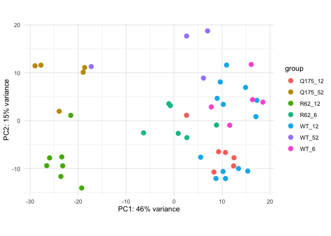<!-- -->

### Scatter

``` r
###### Scattergraph
normCounts <- as.data.frame(getVarianceStabilizedData(ddsFull))
graphCounts <- normCounts

graphCounts <- as.matrix(graphCounts)

compMedian <- function(df,groupName){
  return(rowMedians(df[,colnames(df) %in% sampleTableFull[sampleTableFull$comparison == groupName,]$sample]))
}


lowNormVst <- data.frame(row.names = ensemblGeneListM$ensembl_gene_id, R62_12WK = compMedian(graphCounts, "R62_12"),
                         WT_12WK = compMedian(graphCounts, "WT_12"),
                         Q175_1Y = compMedian(graphCounts, "Q175_52"),
                         WT_1Y = compMedian(graphCounts, "WT_52"),
                         R62_6WK = compMedian(graphCounts, "R62_6"),
                         WT_6WK = compMedian(graphCounts, "WT_6"),
                         Q175_12WK = compMedian(graphCounts, "Q175_12"),
                         external = ensemblGeneListM$external_gene_name)

lowNormVst <- lowNormVst[row.names(lowNormVst) %in% row.names(lowTPMFull),]

R62graph6 <- lowNormVst[,colnames(lowNormVst) %in% c("R62_6WK","WT_6WK", "external")]
ggplot(R62graph6, aes(y=R62_6WK, x=WT_6WK)) + geom_point(alpha = 0.25, colour = "blue") + geom_abline(intercept = 0, slope = 1) + xlim(c(7,22)) + ylim(c(7,22))
```

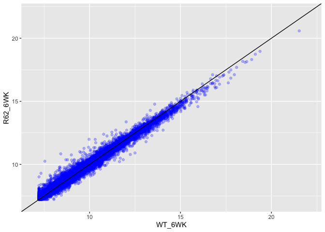<!-- -->

``` r
R62graph12 <- lowNormVst[,colnames(lowNormVst) %in% c("R62_12WK","WT_12WK", "external")]
ggplot(R62graph12, aes(y=R62_12WK, x=WT_12WK)) + geom_point(alpha = 0.25, colour = "red") + geom_abline(intercept = 0, slope = 1) + geom_point(data = R62graph6, aes(y=R62_6WK, x=WT_6WK), alpha = 0.25, colour = "red")+ xlim(c(7,22)) + ylim(c(7,22))
```

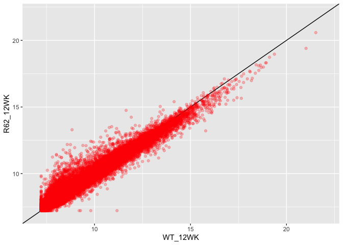<!-- -->

``` r
R62graph6b <- R62graph6
colnames(R62graph6b) <- c("R62", "WT", "external")
R62graph6b$ensembl <- row.names(R62graph6b)
R62graph6b$set <- "6WK"
R62graph12b <- R62graph12
colnames(R62graph12b) <- c("R62", "WT", "external")
R62graph12b$ensembl <- row.names(R62graph12b)
R62graph12b$set <- "12WK"

R62graph <- rbind(R62graph6b, R62graph12b)
R62graph$external <- as.character(R62graph$external)


R62graphRando <- R62graph %>%
  arrange(sample(1:nrow(.)))


r62Scatter <- ggplot(R62graphRando, aes(y=R62, x=WT, colour = set, label = ensembl)) + geom_point(alpha = 1, size = 2) + geom_abline(intercept = 0, slope = 1) + theme_minimal() + scale_color_manual(values=c("red", "orange")) + xlim(c(7,22)) + ylim(c(7,22)) + theme(legend.position = "none") + ylab("R6/2 VST Counts") + xlab("WT VST Counts")


##### Q175
Q175graph12 <- lowNormVst[,colnames(lowNormVst) %in% c("Q175_12WK","WT_12WK", "external")]
ggplot(Q175graph12, aes(y=Q175_12WK, x=WT_12WK)) + geom_point(alpha = 0.25, colour = "blue") + geom_abline(intercept = 0, slope = 1) + xlim(c(7,22)) + ylim(c(7,22)) + theme_minimal()
```

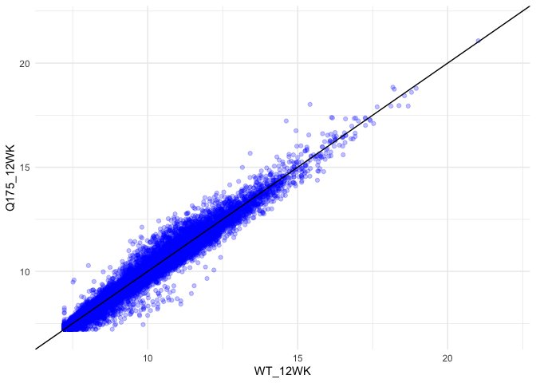<!-- -->

``` r
Q175graph52 <- lowNormVst[,colnames(lowNormVst) %in% c("Q175_1Y","WT_1Y", "external")]
ggplot(Q175graph52, aes(y=Q175_1Y, x=WT_1Y)) + geom_point(alpha = 0.25, colour = "red") + geom_abline(intercept = 0, slope = 1) + xlim(c(7,22)) + ylim(c(7,22)) + theme_minimal()
```

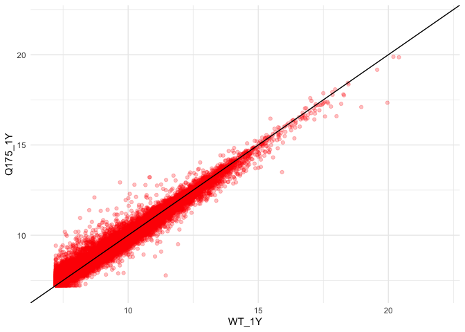<!-- -->

``` r
Q175graph12b <- Q175graph12
colnames(Q175graph12b) <- c("Q175", "WT", "external")
Q175graph12b$ensembl <- row.names(Q175graph12b)
Q175graph12b$set <- "12WK"
Q175graph52b <- Q175graph52
colnames(Q175graph52b) <- c("Q175", "WT", "external")
Q175graph52b$ensembl <- row.names(Q175graph52b)
Q175graph52b$set <- "52WK"

Q175graph <- rbind(Q175graph12b, Q175graph52b)
Q175graph$external <- as.character(Q175graph$external)

Q175graphRando <- Q175graph %>%
  arrange(sample(1:nrow(.)))


q175scatter <- ggplot(Q175graphRando, aes(y=Q175, x=WT, color = set)) + geom_point(alpha = 1) + geom_abline(intercept = 0, slope = 1) + theme_minimal() + scale_color_manual(values=c("#0000B5", "purple"))+ xlim(c(7,22)) + ylim(c(7,22)) + theme(legend.position = "none") + ylab("zQ175 VST Counts") + xlab("WT VST Counts")

r62Scatter | q175scatter
```

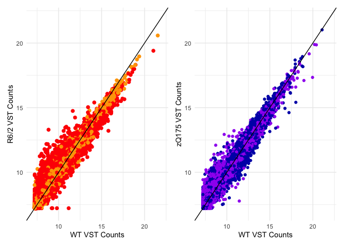<!-- -->

``` r
fig1HM <- c("Plp1", "Fa2h", "Cers2", "Gjc3", "Mal", "Arsg", "Aspa", "Clu", "Mobp", "Lpar1", "Ugt8a", "S100b", "Cnp", "Gpr37", "Pllp", "Cldn11", "Mog", "Mbp", "Mag", "Opalin", "Fgfr2", "Bmp4", "Id3", "Ppp1r1b", "Ngfr", "Pmp22", "Notch1", "Ldlr", "Hmgcs1", "Cyp51", "Pou3f1", "Vim", "Pcdh11x", "Pcdh17", "Pcdh7", "Pcdh10", "Pcdh15", "Bcas1", "Nkx6-2", "Sox10", "Sox1", "Sox2", "Gal3st1", "Lingo1", "Cntn1", "Id2", "Myrf", "Tspan2", "Olig2", "Rest")

normCounts <- as.data.frame(assay(vsd))
normCounts <- merge(normCounts, ensemblGeneListM, by.x = 0, by.y = "ensembl_gene_id")
normCounts <- normCounts[normCounts$external_gene_name %in% fig1HM,]
normCounts <- normCounts[,2:48]
row.names(normCounts) <- normCounts$external_gene_name
normCounts$external_gene_name <- NULL  

scale_rows = function(x){
  m = apply(x, 1, mean, na.rm = T)
  s = apply(x, 1, sd, na.rm = T)
  return((x - m) / s)
}

hCluster <- function(genes){
  temp <- scale_rows(genes)
  rowclust = hclust(dist(temp))
  temp = temp[rowclust$order,]
  return(as.data.frame(temp))
}

fig1HM <- hCluster(normCounts)

fig1HMorder <- row.names(fig1HM)

fig1HM$external_gene_name <- row.names(fig1HM)

fig1HM <- fig1HM %>%
  pivot_longer(-external_gene_name, names_to = "Sample", values_to = "VST")

fig1HM$group <- mapvalues(fig1HM$Sample,sampleTableFull$sample, as.character(sampleTableFull$group))


fig1HM$group <- factor(fig1HM$group, levels = c("WT_6", "R62_6", "WT_12", "R62_12", "Q175_12", "WT_52", "Q175_52"))
fig1HM$external_gene_name <- factor(fig1HM$external_gene_name, levels = fig1HMorder)

fig1HMgg <- ggplot(fig1HM, aes(Sample, external_gene_name)) + geom_tile(aes(fill = VST), colour = "black") + scale_fill_gradientn(colours = c("#009900","#fffcbd","#ff2020"), guide = guide_colourbar(direction = "horizontal", title = "Corrected VST Counts", title.position = "top")) + scale_y_discrete(expand = c(0, 0)) + facet_grid(cols = vars(group), scales = "free", space = "free") + theme(axis.text.x = element_blank(), axis.ticks.x = element_blank(), legend.position = "bottom", legend.direction = "horizontal", axis.title.y = element_blank(), axis.title.x = element_blank(), axis.text.y = element_blank(), axis.ticks.y  = element_blank()) 

ggplot(fig1HM, aes(Sample, external_gene_name)) + geom_tile(aes(fill = VST), colour = "black") + scale_fill_gradientn(colours = c("#009900","#fffcbd","#ff2020"), guide = guide_colourbar(direction = "horizontal", title = "Corrected VST Counts", title.position = "top")) + scale_y_discrete(expand = c(0, 0)) + facet_grid(cols = vars(group), scales = "free", space = "free") + theme(axis.ticks.x = element_blank(), legend.position = "bottom", legend.direction = "horizontal", axis.title.y = element_blank(), axis.title.x = element_blank(), axis.ticks.y  = element_blank())
```

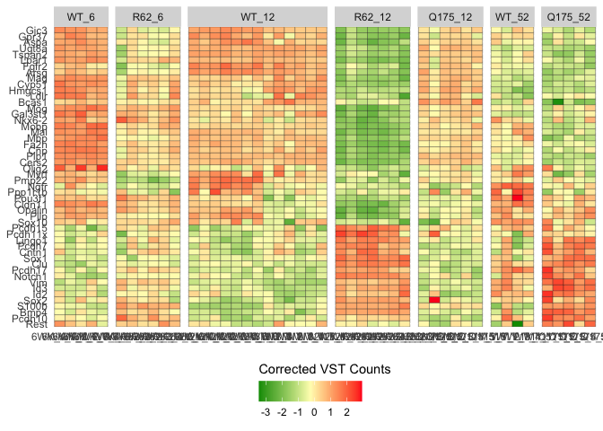<!-- -->

``` r
fig1HMgg
```

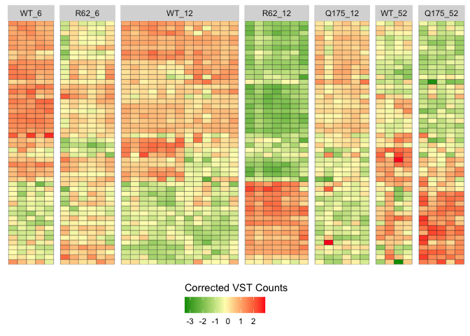<!-- -->

``` r
annotationsFig1 <- data.frame(row.names = levels(fig1HM$external_gene_name))
annotationsFig1$Q175_1Yr <- ifelse(row.names(annotationsFig1) %in% de1YQ175_res$external_gene_name,"Q175_1Yr","NS")
annotationsFig1$R62_12Wk <- ifelse(row.names(annotationsFig1) %in% de12WkR62_res$external_gene_name,"R62_12Wk","NS")
annotationsFig1$R62_6Wk <- ifelse(row.names(annotationsFig1) %in% de6WkR62_res$external_gene_name,"R62_6Wk","NS")

annotationsFig1$R62_6Wk <- factor(annotationsFig1$R62_6Wk)
annotationsFig1$R62_12Wk <- factor(annotationsFig1$R62_12Wk)
annotationsFig1$Q175_1Yr <- factor(annotationsFig1$Q175_1Yr)

annotationsFig1$external_gene_name <- row.names(annotationsFig1)

annotationsFig1 <- annotationsFig1 %>%
  pivot_longer(-external_gene_name, names_to = "Sample", values_to = "Group")

annotationsFig1$external_gene_name <- factor(annotationsFig1$external_gene_name, levels = fig1HMorder)
annotationsFig1$Sample <- factor(annotationsFig1$Sample, levels = c("R62_6Wk", "R62_12Wk", "Q175_1Yr"))
annotationsFig1$Group <- factor(annotationsFig1$Group, levels = c("NS", "R62_6Wk", "R62_12Wk", "Q175_1Yr"))

annotationsFig1HM <- ggplot(annotationsFig1, aes(Sample, external_gene_name)) + geom_tile(aes(fill = Group), colour = "black") + 
  scale_fill_manual(values=c("white", "orange", "red", "purple")) + scale_x_discrete(expand = c(0, 0)) + theme(axis.title.y = element_blank(), axis.text.x = element_blank(), axis.title.x = element_blank(), axis.ticks.x = element_blank(), legend.position = "bottom", axis.text.y = element_text(hjust = .5), axis.ticks.y = element_blank()) 

annotationsFig1HM
```

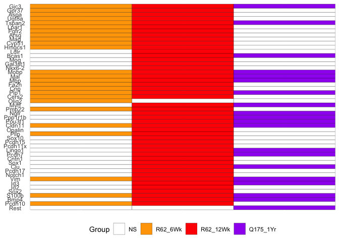<!-- -->

#### Make Venn

``` r
VennGG <- ggVennDiagram(list(R62_6Wk = de6WkR62_res$Row.names, R62_12Wk = de12WkR62_res$Row.names, zQ175_12Wk = de12WkQ175_res$Row.names, zQ175_1Yr = de1YQ175_res$Row.names), label = "count") + theme(legend.position = "none")
```

\#Make Upset Plot

``` r
library(UpSetR)
```

    ## 
    ## Attaching package: 'UpSetR'

    ## The following object is masked from 'package:lattice':
    ## 
    ##     histogram

``` r
listInput <- list("6WkR62" = de6WkR62_res$Row.names, "12WkR62" = de12WkR62_res$Row.names, "12WkQ175" = de12WkQ175_res$Row.names, "1YQ175" = de1YQ175_res$Row.names)
upsetPlot <- upset(fromList(listInput), order.by = "degree")
upsetPlot
```

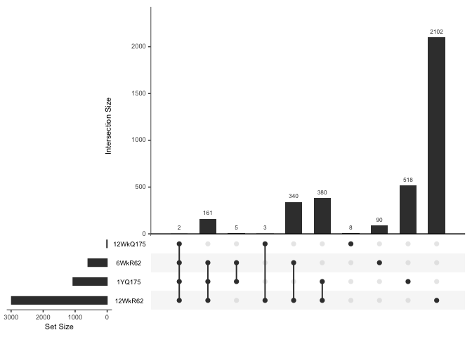<!-- -->

``` r
library(ggplot2)
library(tidyverse)
```

    ## ── Attaching packages ─────────────────────────────────────── tidyverse 1.3.0 ──

    ## ✓ tibble  3.0.3     ✓ forcats 0.4.0
    ## ✓ purrr   0.3.4

    ## Warning: package 'tibble' was built under R version 3.6.2

    ## Warning: package 'purrr' was built under R version 3.6.2

    ## ── Conflicts ────────────────────────────────────────── tidyverse_conflicts() ──
    ## x dplyr::arrange()    masks plyr::arrange()
    ## x dplyr::between()    masks data.table::between()
    ## x dplyr::collapse()   masks IRanges::collapse()
    ## x dplyr::combine()    masks Biobase::combine(), BiocGenerics::combine()
    ## x purrr::compact()    masks plyr::compact()
    ## x dplyr::count()      masks plyr::count(), matrixStats::count()
    ## x dplyr::desc()       masks plyr::desc(), IRanges::desc()
    ## x tidyr::expand()     masks S4Vectors::expand()
    ## x dplyr::failwith()   masks plyr::failwith()
    ## x dplyr::filter()     masks stats::filter()
    ## x dplyr::first()      masks data.table::first(), S4Vectors::first()
    ## x dplyr::id()         masks plyr::id()
    ## x dplyr::lag()        masks stats::lag()
    ## x dplyr::last()       masks data.table::last()
    ## x dplyr::mutate()     masks plyr::mutate()
    ## x ggplot2::Position() masks BiocGenerics::Position(), base::Position()
    ## x purrr::reduce()     masks GenomicRanges::reduce(), IRanges::reduce()
    ## x dplyr::rename()     masks plyr::rename(), S4Vectors::rename()
    ## x dplyr::select()     masks biomaRt::select()
    ## x purrr::simplify()   masks DelayedArray::simplify()
    ## x dplyr::slice()      masks IRanges::slice()
    ## x Hmisc::src()        masks dplyr::src()
    ## x dplyr::summarise()  masks plyr::summarise()
    ## x Hmisc::summarize()  masks dplyr::summarize(), plyr::summarize()
    ## x purrr::transpose()  masks data.table::transpose()

``` r
de6WkR62_res$comparison <- "R62 6WK"
de12WkR62_res$comparison <- "R62 12WK"
de12WkQ175_res$comparison <- "ZQ175 12WK"
de1YQ175_res$comparison <- "ZQ175 1YR"

deAll <- rbind(de6WkR62_res, de12WkR62_res, de12WkQ175_res, de1YQ175_res)
```

### GO Graph

``` r
files <- paste0("data_for_import/",c("de6WkR62_IPA.txt", "de12WkR62_IPA.txt", "de1YzQ175_IPA.txt"))
compNames <- c("R62_6wk", "R62_12wk", "zQ175_1Yr")

for(i in 1:length(files)){
  canonicalIPA <- fread(files[i], skip = 25,drop = c(4,6))
  names(canonicalIPA) <- c("Pathway", "pVal", "zScore", "Genes")
  canonicalIPA$type <- "Canonical"
  upstreamIPA <- fread(files[i], skip = 25+nrow(canonicalIPA), drop = c(1:2,4:6,8:10,13:14))
  upstreamIPA <- upstreamIPA[,c(1,3,2,4)]
  names(upstreamIPA) <- c("Pathway", "pVal", "zScore", "Genes")
  upstreamIPA$Pathway <- paste0(upstreamIPA$Pathway, " Signaling")
  upstreamIPA$pVal <- -log10(upstreamIPA$pVal)
  upstreamIPA$type <- "Upstream"
  functionalIPA <- fread(files[i], skip = 29 + nrow(canonicalIPA) + nrow(upstreamIPA), drop = c(1,2,5,7,8,10,11))
  names(functionalIPA) <- c("Pathway", "pVal", "zScore", "Genes")
  functionalIPA$pVal <- -log10(functionalIPA$pVal)
  functionalIPA$type <- "Functional"
  if(i == 1){
    IPA <- rbind(canonicalIPA, upstreamIPA, functionalIPA)
    IPA$comparison <- compNames[i]
  } else {
    tempIPA <- rbind(canonicalIPA, upstreamIPA, functionalIPA)
    tempIPA$comparison <- compNames[i]
    IPA <- rbind(IPA, tempIPA)
  }
}
```

    ## Warning in fread(files[i], skip = 25, drop = c(4, 6)): Detected 5 column names
    ## but the data has 6 columns (i.e. invalid file). Added 1 extra default column
    ## name for the first column which is guessed to be row names or an index. Use
    ## setnames() afterwards if this guess is not correct, or fix the file write
    ## command that created the file to create a valid file.

    ## Warning in fread(files[i], skip = 25, drop = c(4, 6)): Stopped early on line
    ## 517. Expected 6 fields but found 0. Consider fill=TRUE and comment.char=.
    ## First discarded non-empty line: <<Upstream Regulators for My Projects-
    ## >HD_Myelination_Paper->de6WkR62_res2 - 2019-03-29 11:31 AM>>

    ## Warning in fread(files[i], skip = 25 + nrow(canonicalIPA), drop = c(1:2, :
    ## Stopped early on line 1193. Expected 14 fields but found 0. Consider fill=TRUE
    ## and comment.char=. First discarded non-empty line: <<Causal Networks for My
    ## Projects->HD_Myelination_Paper->de6WkR62_res2 - 2019-03-29 11:31 AM>>

    ## Warning in fread(files[i], skip = 29 + nrow(canonicalIPA) + nrow(upstreamIPA), :
    ## Stopped early on line 1698. Expected 11 fields but found 0. Consider fill=TRUE
    ## and comment.char=. First discarded non-empty line: <<Tox Functions for My
    ## Projects->HD_Myelination_Paper->de6WkR62_res2 - 2019-03-29 11:31 AM>>

    ## Warning in fread(files[i], skip = 25, drop = c(4, 6)): Detected 5 column names
    ## but the data has 6 columns (i.e. invalid file). Added 1 extra default column
    ## name for the first column which is guessed to be row names or an index. Use
    ## setnames() afterwards if this guess is not correct, or fix the file write
    ## command that created the file to create a valid file.

    ## Warning in fread(files[i], skip = 25, drop = c(4, 6)): Stopped early on line
    ## 639. Expected 6 fields but found 0. Consider fill=TRUE and comment.char=.
    ## First discarded non-empty line: <<Upstream Regulators for My Projects-
    ## >HD_Myelination_Paper->de12WkR62_res - 2019-03-28 04:30 PM>>

    ## Warning in fread(files[i], skip = 25 + nrow(canonicalIPA), drop = c(1:2, :
    ## Stopped early on line 1418. Expected 14 fields but found 0. Consider fill=TRUE
    ## and comment.char=. First discarded non-empty line: <<Causal Networks for My
    ## Projects->HD_Myelination_Paper->de12WkR62_res - 2019-03-28 04:30 PM>>

    ## Warning in fread(files[i], skip = 29 + nrow(canonicalIPA) + nrow(upstreamIPA), :
    ## Stopped early on line 1923. Expected 11 fields but found 0. Consider fill=TRUE
    ## and comment.char=. First discarded non-empty line: <<Tox Functions for My
    ## Projects->HD_Myelination_Paper->de12WkR62_res - 2019-03-28 04:30 PM>>

    ## Warning in fread(files[i], skip = 25, drop = c(4, 6)): Detected 5 column names
    ## but the data has 6 columns (i.e. invalid file). Added 1 extra default column
    ## name for the first column which is guessed to be row names or an index. Use
    ## setnames() afterwards if this guess is not correct, or fix the file write
    ## command that created the file to create a valid file.

    ## Warning in fread(files[i], skip = 25, drop = c(4, 6)): Stopped early on line
    ## 556. Expected 6 fields but found 0. Consider fill=TRUE and comment.char=.
    ## First discarded non-empty line: <<Upstream Regulators for My Projects-
    ## >HD_Myelination_Paper->de1YQ175_res - 2019-03-28 04:51 PM>>

    ## Warning in fread(files[i], skip = 25 + nrow(canonicalIPA), drop = c(1:2, :
    ## Stopped early on line 898. Expected 14 fields but found 0. Consider fill=TRUE
    ## and comment.char=. First discarded non-empty line: <<Causal Networks for My
    ## Projects->HD_Myelination_Paper->de1YQ175_res - 2019-03-28 04:51 PM>>

    ## Warning in fread(files[i], skip = 29 + nrow(canonicalIPA) + nrow(upstreamIPA), :
    ## Stopped early on line 1403. Expected 11 fields but found 0. Consider fill=TRUE
    ## and comment.char=. First discarded non-empty line: <<Tox Functions for My
    ## Projects->HD_Myelination_Paper->de1YQ175_res - 2019-03-28 04:51 PM>>

``` r
rm(canonicalIPA)
rm(upstreamIPA)
rm(functionalIPA)
rm(tempIPA)

ogIPA <- IPA

GOcats <- read.csv("data_for_import/GOcats.csv", stringsAsFactors = F)$Gocats
GOcats <- c(GOcats, "Wnt/β-catenin Signaling", "Superpathway of Cholesterol Biosynthesis")
GOgraph <- IPA[IPA$Pathway %in% GOcats,]
GOgraph <- GOgraph[GOgraph$pVal > -log10(0.05),]

catOrder <- GOgraph %>% group_by(Pathway) %>%
  dplyr::summarise(max = max(pVal))
```

    ## `summarise()` ungrouping output (override with `.groups` argument)

``` r
catOrder <- catOrder[order(catOrder$max, decreasing = T),]

GOgraph$Pathway <- factor(GOgraph$Pathway, levels = rev(catOrder$Pathway))

GOgraph$comparison <- factor(GOgraph$comparison, levels = rev(c("R62_6wk", "R62_12wk", "zQ175_1Yr")))

GOgg <- ggplot(GOgraph ,aes(fill = comparison, y = Pathway,  x = pVal)) + geom_col(position=position_dodge2(0.75, preserve = c("single"))) + scale_fill_manual(values=c("purple", "red", "orange")) + theme_bw()

GOgg
```

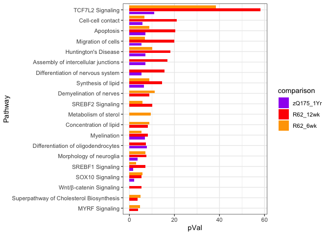<!-- -->

``` r
###Write out for Supp Table 4
filteredIPA <- IPA[IPA$pVal > -log10(0.05),]
filteredIPA <- filteredIPA[order(filteredIPA$pVal, decreasing = T),]
#write.xlsx(filteredIPA, sheetName = "Signifciant_IPA_Terms", file = "supTables/SupTable4.xlsx", row.names = F)
```

## TCF7L2 edges

``` r
edges <- filteredIPA %>% 
  mutate(genes = strsplit(as.character(Genes), ",")) %>% 
  unnest(genes) %>% .[,-4]

edgesTCF7L2 <- edges[edges$genes %in% edges[edges$Pathway == "TCF7L2 Signaling",]$genes,]
edgesTCF7L2 <- edgesTCF7L2[edgesTCF7L2$Pathway != "TCF7L2 Signaling",]
```

### Figure 1 Layout

``` r
fig1top <- ((PCAgg | VennGG) / plot_spacer()) + plot_layout(height = c(1,4))
fig1top
```

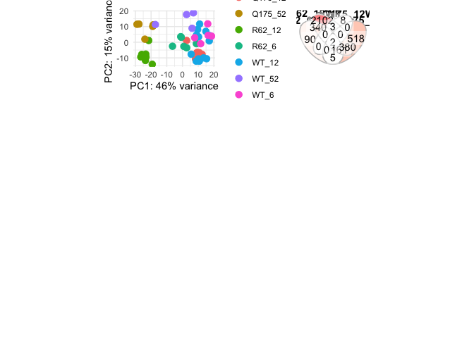<!-- -->

``` r
#ggsave(plot = fig1top, filename = "figures/fig1top.pdf", device = "pdf", units = c("in"), height = 11, width = 10, useDingbats=FALSE)


fig1bottom <- (plot_spacer() / (r62Scatter | q175scatter) / ((fig1HMgg | annotationsFig1HM | GOgg)+ plot_layout(width = c(1, .1, .5)))) + plot_layout(height = c(1,1,3))

fig1bottom
```

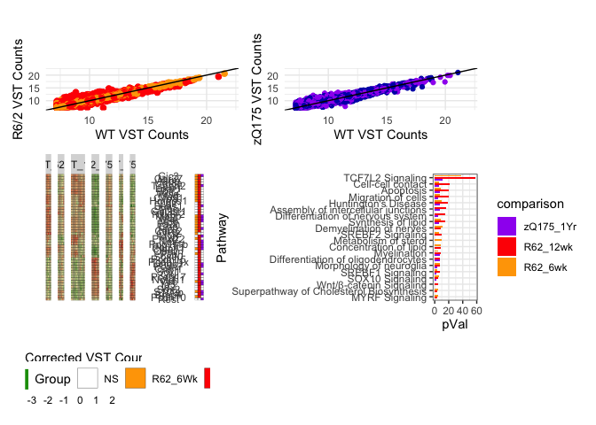<!-- -->

``` r
#ggsave(plot = fig1bottom, filename = "figures/fig1bottom.pdf", device = "pdf", units = c("in"), height = 11, width = 10, useDingbats=FALSE)
```

### WGCNA

``` r
library(WGCNA)
```

    ## Loading required package: dynamicTreeCut

    ## Loading required package: fastcluster

    ## 
    ## Attaching package: 'fastcluster'

    ## The following object is masked from 'package:stats':
    ## 
    ##     hclust

    ## 

    ## 
    ## Attaching package: 'WGCNA'

    ## The following object is masked from 'package:IRanges':
    ## 
    ##     cor

    ## The following object is masked from 'package:S4Vectors':
    ## 
    ##     cor

    ## The following object is masked from 'package:stats':
    ## 
    ##     cor

``` r
abundanceFull <- txi.rsem$abundance
datExpr <- getVarianceStabilizedData(ddsFull)
datExpr <- datExpr[row.names(datExpr) %in% row.names(lowTPMFull),]
nrow(datExpr)
```

    ## [1] 14392

``` r
datExpr0 <- t(datExpr)
gsg = goodSamplesGenes(datExpr0, verbose = 3);
```

    ##  Flagging genes and samples with too many missing values...
    ##   ..step 1

``` r
gsg$allOK
```

    ## [1] TRUE

``` r
table(gsg$allOK)
```

    ## 
    ## TRUE 
    ##    1

``` r
if (!gsg$allOK)
{
  # Optionally, print the gene and sample names that were removed:
  if (sum(!gsg$goodGenes)>0)
    printFlush(paste("Removing genes:", paste(names(datExpr0)[!gsg$goodGenes], collapse = ", ")));
  if (sum(!gsg$goodSamples)>0)
    printFlush(paste("Removing samples:", paste(rownames(datExpr0)[!gsg$goodSamples], collapse = ", ")));
  # Remove the offending genes and samples from the data:
  datExpr0 = datExpr0[gsg$goodSamples, gsg$goodGenes]
}

sampleTree = hclust(dist(datExpr0), method = "average");
# Plot the sample tree: Open a graphic output window of size 12 by 9 inches
# The user should change the dimensions if the window is too large or too small.
sizeGrWindow(12,9)
#pdf(file = "Plots/sampleClustering.pdf", width = 12, height = 9);
par(cex = 0.6);
par(mar = c(0,4,2,0))
plot(sampleTree, main = "Sample clustering to detect outliers", sub="", xlab="", cex.lab = 1.5,
     cex.axis = 1.5, cex.main = 2)

# Plot a line to show the cut
#abline(h = 50, col = "red");
# Determine cluster under the line
#clust = cutreeStatic(sampleTree, cutHeight = 50, minSize = 10)
#table(clust)
# clust 1 contains the samples we want to keep.
#keepSamples = (clust==1)
#datExpr0 = datExpr0[keepSamples, ]
nGenes = ncol(datExpr0)
nSamples = nrow(datExpr0)


disableWGCNAThreads()

datExpr0 = datExpr0
# Choose a set of soft-thresholding powers
powers = seq(from = 1, to=20, by=1)
powers
```

    ##  [1]  1  2  3  4  5  6  7  8  9 10 11 12 13 14 15 16 17 18 19 20

``` r
# Call the network topology analysis function
sft = pickSoftThreshold(datExpr0, powerVector = powers, verbose = 5)
```

    ## pickSoftThreshold: will use block size 3108.
    ##  pickSoftThreshold: calculating connectivity for given powers...
    ##    ..working on genes 1 through 3108 of 14392
    ##    ..working on genes 3109 through 6216 of 14392
    ##    ..working on genes 6217 through 9324 of 14392
    ##    ..working on genes 9325 through 12432 of 14392
    ##    ..working on genes 12433 through 14392 of 14392
    ##    Power SFT.R.sq  slope truncated.R.sq mean.k. median.k. max.k.
    ## 1      1    0.507  1.160          0.871  4540.0  4490.000   7290
    ## 2      2    0.323 -0.292          0.821  2130.0  1900.000   4830
    ## 3      3    0.862 -0.704          0.946  1200.0   935.000   3570
    ## 4      4    0.913 -0.892          0.948   759.0   503.000   2800
    ## 5      5    0.933 -0.983          0.958   515.0   288.000   2280
    ## 6      6    0.945 -1.040          0.964   367.0   171.000   1900
    ## 7      7    0.955 -1.070          0.973   273.0   105.000   1620
    ## 8      8    0.961 -1.100          0.977   208.0    65.900   1400
    ## 9      9    0.962 -1.120          0.976   163.0    42.400   1220
    ## 10    10    0.968 -1.130          0.981   131.0    27.900   1080
    ## 11    11    0.963 -1.140          0.976   106.0    18.800    962
    ## 12    12    0.957 -1.150          0.972    87.5    12.800    867
    ## 13    13    0.955 -1.160          0.970    73.0     8.830    786
    ## 14    14    0.956 -1.170          0.970    61.6     6.110    716
    ## 15    15    0.961 -1.170          0.975    52.5     4.280    656
    ## 16    16    0.953 -1.180          0.967    45.1     3.070    605
    ## 17    17    0.956 -1.180          0.968    39.1     2.200    559
    ## 18    18    0.961 -1.180          0.973    34.1     1.590    519
    ## 19    19    0.962 -1.180          0.974    29.9     1.150    483
    ## 20    20    0.958 -1.190          0.972    26.4     0.856    451

``` r
# Plot the results:
sizeGrWindow(9, 5)
par(mfrow = c(1,2));
cex1 = 0.9;
# Scale-free topology fit index as a function of the soft-thresholding power
plot(sft$fitIndices[,1], -sign(sft$fitIndices[,3])*sft$fitIndices[,2],
     xlab="Soft Threshold (power)",ylab="Scale Free Topology Model Fit,signed R^2",type="n",
     main = paste("Scale independence"));
text(sft$fitIndices[,1], -sign(sft$fitIndices[,3])*sft$fitIndices[,2],
     labels=powers,cex=cex1,col="red");
# this line corresponds to using an R^2 cut-off of h
abline(h=0.90,col="red")
# Mean connectivity as a function of the soft-thresholding power
plot(sft$fitIndices[,1], sft$fitIndices[,5],
     xlab="Soft Threshold (power)",ylab="Mean Connectivity", type="n",
     main = paste("Mean connectivity"))
text(sft$fitIndices[,1], sft$fitIndices[,5], labels=powers, cex=cex1,col="red")

softPower = 4


adjacency = adjacency(datExpr0, power = softPower, corFnc = "bicor", type = "signed")
```

    ## alpha: 1.000000

    ## Warning in (function (x, y = NULL, robustX = TRUE, robustY = TRUE, use =
    ## "all.obs", : bicor: zero MAD in variable 'x'. Pearson correlation was used for
    ## individual columns with zero (or missing) MAD.

``` r
#adjacency = adjacency(datExpr0, power = softPower)
#adjacency = adjacency(datExpr0, power = softPower, corFnc = "bicor", type = "unsigned")


TOM = TOMsimilarity(adjacency, TOMType = "signed");
```

    ## ..connectivity..
    ## ..matrix multiplication (system BLAS)..
    ## ..normalization..
    ## ..done.

``` r
#TOM = TOMsimilarity(adjacency);
#TOM = TOMsimilarity(adjacency, TOMType = "unsigned");

dissTOM = 1-TOM

# Call the hierarchical clustering function
geneTree = hclust(as.dist(dissTOM), method = "average");
# Plot the resulting clustering tree (dendrogram)
sizeGrWindow(12,9)
plot(geneTree, xlab="", sub="", main = "Gene clustering on TOM-based dissimilarity",
     labels = FALSE, hang = 0.04);

# We like large modules, so we set the minimum module size relatively high:
minModuleSize = 30;
# Module identification using dynamic tree cut:
dynamicMods = cutreeDynamic(dendro = geneTree, distM = dissTOM,
                            deepSplit = 2, pamRespectsDendro = FALSE,
                            minClusterSize = minModuleSize);
```

    ##  ..cutHeight not given, setting it to 0.926  ===>  99% of the (truncated) height range in dendro.
    ##  ..done.

``` r
table(dynamicMods)
```

    ## dynamicMods
    ##    1    2    3    4    5    6    7 
    ## 5745 4824 1375 1250  578  353  267

``` r
# Convert numeric lables into colors
dynamicColors = labels2colors(dynamicMods)
table(dynamicColors)
```

    ## dynamicColors
    ##     black      blue     brown     green       red turquoise    yellow 
    ##       267      4824      1375       578       353      5745      1250

``` r
# Plot the dendrogram and colors underneath
sizeGrWindow(8,6)
plotDendroAndColors(geneTree, dynamicColors, "Dynamic Tree Cut",
                    dendroLabels = FALSE, hang = 0.03,
                    addGuide = TRUE, guideHang = 0.05,
                    main = "Gene dendrogram and module colors")

# Calculate eigengenes
MEList = moduleEigengenes(datExpr0, colors = dynamicColors)
MEs = MEList$eigengenes
# Calculate dissimilarity of module eigengenes
MEDiss = 1-cor(MEs);
# Cluster module eigengenes
METree = hclust(as.dist(MEDiss), method = "average");
# Plot the result
sizeGrWindow(7, 6)
plot(METree, main = "Clustering of module eigengenes",
     xlab = "", sub = "")

MEDissThres = 0.25
TPMfiltered <- TPM[TPM$Row.names %in% colnames(datExpr0),]

yessumPreCut <- data.frame(gene = TPMfiltered$external_gene_name, module = dynamicColors)
table(yessumPreCut$module)
```

    ## 
    ##     black      blue     brown     green       red turquoise    yellow 
    ##       267      4824      1375       578       353      5745      1250

``` r
# Plot the cut line into the dendrogram
abline(h=MEDissThres, col = "red")
# Call an automatic merging function
merge = mergeCloseModules(datExpr0, dynamicColors, cutHeight = MEDissThres, verbose = 3)
```

    ##  mergeCloseModules: Merging modules whose distance is less than 0.25
    ##    multiSetMEs: Calculating module MEs.
    ##      Working on set 1 ...
    ##      moduleEigengenes: Calculating 7 module eigengenes in given set.
    ##    multiSetMEs: Calculating module MEs.
    ##      Working on set 1 ...
    ##      moduleEigengenes: Calculating 5 module eigengenes in given set.
    ##    Calculating new MEs...
    ##    multiSetMEs: Calculating module MEs.
    ##      Working on set 1 ...
    ##      moduleEigengenes: Calculating 5 module eigengenes in given set.

``` r
# The merged module colors

mergedColors = merge$colors;
table(mergedColors)
```

    ## mergedColors
    ##     black      blue     brown     green turquoise 
    ##       620      4824      2625       578      5745

``` r
# Eigengenes of the new merged modules:
mergedMEs = merge$newMEs


sizeGrWindow(12, 9)
#pdf(file = "Plots/geneDendro-3.pdf", wi = 9, he = 6)
plotDendroAndColors(geneTree, cbind(dynamicColors, mergedColors),
                    c("Dynamic Tree Cut", "Merged dynamic"),
                    dendroLabels = FALSE, hang = 0.03,
                    addGuide = TRUE, guideHang = 0.05)

# Rename to moduleColors
moduleColors = mergedColors
# Construct numerical labels corresponding to the colors
colorOrder = c("grey", standardColors(50));
moduleLabels = match(moduleColors, colorOrder)-1;
MEs = mergedMEs;
#dev.off()
names(MEs)
```

    ## [1] "MEblack"     "MEblue"      "MEturquoise" "MEbrown"     "MEgreen"

``` r
table(moduleColors)
```

    ## moduleColors
    ##     black      blue     brown     green turquoise 
    ##       620      4824      2625       578      5745

``` r
MEDiss = 1-cor(MEs);
# Cluster module eigengenes
METree = hclust(as.dist(MEDiss), method = "average");
# Plot the result
sizeGrWindow(7, 6)
plot(METree, main = "Clustering of module eigengenes",
     xlab = "", sub = "")


modulesEnsembl <- data.frame(gene = TPMfiltered$Row.names, module = moduleColors)
modulesGenes <- data.frame(gene = TPMfiltered$external_gene_name, module = moduleColors)
table(modulesEnsembl$module)
```

    ## 
    ##     black      blue     brown     green turquoise 
    ##       620      4824      2625       578      5745

``` r
### For SupTable
supWGCNA <- data.frame(ensembl_gene_id = TPMfiltered$Row.names, external_gene_name = TPMfiltered$external_gene_name, module = moduleColors)
#write.xlsx(supWGCNA, "supTables/SupTable3.xlsx")


sigGenes <- rbind(de6WkR62_res, de12WkR62_res, de12WkQ175_res, de1YQ175_res)

black <- modulesGenes[modulesGenes$module == "black",]
blackSig <- black[black$gene %in% sigGenes$external_gene_name,]
blackSig <- merge(blackSig, ensemblGeneListM, by.x = 1, by.y = "external_gene_name")
#write.table(blackSig$gene, "output/BlackSig.txt", quote = F, row.names = F, sep = "\t")

blue <- modulesGenes[modulesGenes$module == "blue",]
blueSig <- blue[blue$gene %in% sigGenes$external_gene_name,]
#write.table(blueSig$gene, "blueSig.txt", quote = F, row.names = F, sep = "\t")

brown <- modulesGenes[modulesGenes$module == "brown",]
brownSig <- brown[brown$gene %in% sigGenes$external_gene_name,]
#write.table(brownSig$gene, "brownSig.txt", quote = F, row.names = F, sep = "\t")

green <- modulesGenes[modulesGenes$module == "green",]
greenSig <- green[green$gene %in% sigGenes$external_gene_name,]
#write.table(greenSig$gene, "greenSig.txt", quote = F, row.names = F, sep = "\t")

turquoise <- modulesGenes[modulesGenes$module == "turquoise",]
turquoiseSig <- turquoise[turquoise$gene %in% sigGenes$external_gene_name,]
#write.table(turquoiseSig$gene, "turquoiseSig.txt", quote = F, row.names = F, sep = "\t")
```

``` r
files <- "data_for_import/IPA/blackSigIPA.txt"
compNames <- c("Black")

for(i in 1:length(files)){
  canonicalIPA <- fread(files[i], skip = "Canonical",drop = c(4,6))
  names(canonicalIPA) <- c("Pathway", "pVal", "zScore", "Genes")
  canonicalIPA$type <- "Canonical"
  upstreamIPA <- fread(files[i], skip = "Upstream Regulators", drop = c(1:2,4:5,7:9,12:13))
  upstreamIPA <- upstreamIPA[,c(1,3,2,4)]
  names(upstreamIPA) <- c("Pathway", "pVal", "zScore", "Genes")
  upstreamIPA$Pathway <- paste0(upstreamIPA$Pathway, " Signaling")
  upstreamIPA$pVal <- -log10(upstreamIPA$pVal)
  upstreamIPA$type <- "Upstream"
  functionalIPA <- fread(files[i], skip = "Diseases and Bio", drop = c(1,2,5,7,8,10,11))
  names(functionalIPA) <- c("Pathway", "pVal", "zScore", "Genes")
  functionalIPA$pVal <- -log10(functionalIPA$pVal)
  functionalIPA$type <- "Functional"
  if(i == 1){
    IPA <- rbind(canonicalIPA, upstreamIPA, functionalIPA)
    IPA$comparison <- compNames[i]
  } else {
    tempIPA <- rbind(canonicalIPA, upstreamIPA, functionalIPA)
    tempIPA$comparison <- compNames[i]
    IPA <- rbind(IPA, tempIPA)
  }
}
```

    ## Warning in fread(files[i], skip = "Canonical", drop = c(4, 6)): Detected 5
    ## column names but the data has 6 columns (i.e. invalid file). Added 1 extra
    ## default column name for the first column which is guessed to be row names or an
    ## index. Use setnames() afterwards if this guess is not correct, or fix the file
    ## write command that created the file to create a valid file.

    ## Warning in fread(files[i], skip = "Canonical", drop = c(4, 6)): Stopped early on
    ## line 405. Expected 6 fields but found 0. Consider fill=TRUE and comment.char=.
    ## First discarded non-empty line: <<Upstream Regulators for My Projects-
    ## >hdMouse_Final->BlackSig - 2019-04-13 08:24 PM>>

    ## Warning in fread(files[i], skip = "Upstream Regulators", drop = c(1:2, 4:5, :
    ## Stopped early on line 690. Expected 13 fields but found 0. Consider fill=TRUE
    ## and comment.char=. First discarded non-empty line: <<Causal Networks for My
    ## Projects->hdMouse_Final->BlackSig - 2019-04-13 08:24 PM>>

    ## Warning in fread(files[i], skip = "Diseases and Bio", drop = c(1, 2, 5, :
    ## Stopped early on line 1195. Expected 11 fields but found 0. Consider fill=TRUE
    ## and comment.char=. First discarded non-empty line: <<Tox Functions for My
    ## Projects->hdMouse_Final->BlackSig - 2019-04-13 08:24 PM>>

``` r
rm(canonicalIPA)
rm(upstreamIPA)
rm(functionalIPA)

IPA[is.na(IPA$zScore)]$zScore <- 0
ogIPA <- IPA
IPA <- IPA[IPA$pVal > -log10(0.05),]
IPA <- IPA[order(IPA$pVal, decreasing = T),]

#write.xlsx(IPA, "supTables/supTable4.xlsx", row.names = F)
```

# WGCNA Graph

``` r
nrow(blackSig) / nrow(black) 
```

    ## [1] 0.7080645

### Isoform analysis

``` r
temp = list.files(path = "./data_for_import/rsemHumanIsoforms", pattern="isoforms.results")

names(temp) <- substr(temp,1,nchar(temp)-22)


txi.rsem.isoforms <- tximport(paste0("./data_for_import/rsemHumanIsoforms/",temp), txIn = T, txOut = T, type = "rsem")
```

    ## reading in files with read_tsv

    ## 1 2 3 4 5 6 7 8 9 10 11 12 13 14 15 16 17 18 19 20 21 22 23 24 25 26 27 28

``` r
for(i in 1:3){
  colnames(txi.rsem.isoforms[[i]]) <- names(temp)
}

names(temp)
```

    ##  [1] "CTR02A_CD140a" "CTR02B_CD140a" "CTR02C_CD140a" "CTR02D_CD140a"
    ##  [5] "CTR02E_CD140a" "CTR02F_CD140a" "CTR19A_CD140a" "CTR19B_CD140a"
    ##  [9] "CTR19C_CD140a" "CTR19D_CD140a" "CTR19F_CD140a" "CTR19H_CD140a"
    ## [13] "HD17A_CD140a"  "HD17B_CD140a"  "HD17C_CD140a"  "HD17E_CD140a" 
    ## [17] "HD17F_CD140a"  "HD18A_CD140a"  "HD18B_CD140a"  "HD18C_CD140a" 
    ## [21] "HD18D_CD140a"  "HD18F_CD140a"  "HD20A_CD140a"  "HD20C_CD140a" 
    ## [25] "HD20D_CD140a"  "HD20E_CD140a"  "HD20F_CD140a"  "HD20G_CD140a"

``` r
isoformTPM <- txi.rsem.isoforms$abundance

filename="data_for_import/humanIsoformEnsembl.csv"
if(file.exists(filename)){
  ensemblTranscriptListH <- read.csv(filename)} else{
    marth <- useMart(biomart = "ENSEMBL_MART_ENSEMBL", dataset = "hsapiens_gene_ensembl", host = 'http://jan2019.archive.ensembl.org/', ensemblRedirect = T)
    ensemblTranscriptListH <- getBM(attributes = c("ensembl_transcript_id", "external_transcript_name", "ensembl_gene_id","external_gene_name", "gene_biotype", "transcript_biotype", "description"), filters = "ensembl_transcript_id",values = row.names(isoformTPM), mart = marth)
    write.csv(ensemblTranscriptListH, filename, row.names = F)
  }


isoformTPM <- merge(isoformTPM, ensemblTranscriptListH, by.x = 0, by.y = "ensembl_transcript_id")
isoformTPM <- isoformTPM[isoformTPM$external_gene_name == "TCF7L2",]


isoformTPM$Ctrl <- rowMeans(isoformTPM[,2:13])
isoformTPM$HD <- rowMeans(isoformTPM[,14:29])

isoformTPM$CtrlSD <- rowSds(as.matrix(isoformTPM[,2:13]))/sqrt(12)
isoformTPM$HDSD <- rowSds(as.matrix(isoformTPM[,14:29]))/sqrt(16)


isoformTPM <- isoformTPM[isoformTPM$transcript_biotype == "protein_coding",]
isoformTPM <- isoformTPM[isoformTPM$Ctrl > 1 | isoformTPM$HD > 1,]


isoformGG <- rbind(data.frame(transcript = isoformTPM$external_transcript_name, mean = isoformTPM$Ctrl, sd = isoformTPM$CtrlSD, group = "Control"), data.frame(transcript = isoformTPM$external_transcript_name, mean = isoformTPM$HD, sd = isoformTPM$HDSD, group = "HD"))


limits <- aes(ymax = isoformGG$mean + isoformGG$sd,  
  ymin =  isoformGG$mean - isoformGG$sd)

isoformGG <- isoformGG[order(isoformGG$mean, decreasing = T),]
isoformGG$transcript <- factor(isoformGG$transcript, levels = rev(isoformGG[!duplicated(isoformGG$transcript),]$transcript
))

isoformGG$group <- factor(isoformGG$group, levels = c("HD", "Control"))


isoformPlotPC <- ggplot(isoformGG, aes(fill = group, y = mean, x = transcript))  + geom_errorbar(limits, position=position_dodge(.75), width = 0.75) + geom_col(width=0.75,    
  position=position_dodge(0.75))  + coord_flip() + theme_minimal() + scale_y_continuous(expand = c(0, 0), limits = c(0,7)) + theme(panel.grid.major.y = element_blank(), panel.grid.minor.y = element_blank(), panel.border = element_rect(fill  = NA), legend.position = "bottom", axis.title.y = element_blank()) + ylab("Isoform TPM") + geom_vline(xintercept = seq(0.5, length(unique(isoformGG$transcript)), by = 1), color="lightgray", size=.5, alpha=.5) #+ scale_fill_manual(values = c("#18BA0F", "#2E30FF", "#ff2020"))

isoformPlotPC
```

    ## Warning: Use of `isoformGG$mean` is discouraged. Use `mean` instead.

    ## Warning: Use of `isoformGG$sd` is discouraged. Use `sd` instead.

    ## Warning: Use of `isoformGG$mean` is discouraged. Use `mean` instead.

    ## Warning: Use of `isoformGG$sd` is discouraged. Use `sd` instead.

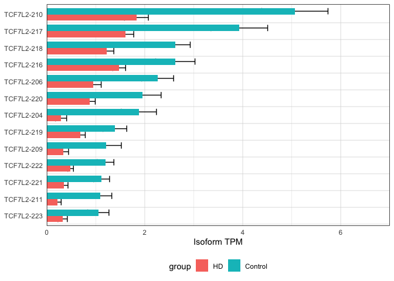<!-- -->

\#CNS genes HM

``` r
CNSgenes <- read.csv("data_for_import/CNSgenes.csv")
CNSgenes$Gene <- capitalize(tolower(CNSgenes$Gene))
CNSgenes$label <- paste0(CNSgenes$Gene, " (", CNSgenes$Lineage, ")")


normCounts <- as.data.frame(assay(vsd))
normCounts <- merge(normCounts, ensemblGeneListM, by.x = 0, by.y = "ensembl_gene_id")
normCounts <- normCounts[normCounts$external_gene_name %in% CNSgenes$Gene,]
normCounts <- normCounts[,2:48]
row.names(normCounts) <- normCounts$external_gene_name
normCounts$external_gene_name <- NULL  


figS5HM <- normCounts
figS5HM <- figS5HM[match(CNSgenes$Gene, row.names(figS5HM)),]
row.names(figS5HM) <- CNSgenes$label


figS5HM$label <- row.names(figS5HM)

figS5HM <- figS5HM %>%
  pivot_longer(-label, names_to = "Sample", values_to = "VST")

figS5HM$group <- mapvalues(figS5HM$Sample,sampleTableFull$sample, as.character(sampleTableFull$group))


figS5HM$group <- factor(figS5HM$group, levels = c("WT_6", "R62_6", "WT_12", "R62_12", "Q175_12", "WT_52", "Q175_52"))
figS5HM$label <- factor(figS5HM$label, levels = rev(CNSgenes$label))

figS5HMgg <- ggplot(figS5HM, aes(Sample, label)) + geom_tile(aes(fill = VST), colour = "black") + scale_fill_gradientn(colours = c("#009900","#fffcbd","#ff2020"), guide = guide_colourbar(direction = "horizontal", title = "Corrected VST Counts", title.position = "top")) + scale_y_discrete(expand = c(0, 0), position = "right") + facet_grid(cols = vars(group), scales = "free", space = "free") + theme(axis.text.x = element_blank(), axis.ticks.x = element_blank(), legend.position = "bottom", legend.direction = "horizontal", axis.title.y = element_blank(), axis.title.x = element_blank(), axis.ticks.y  = element_blank())

figS5HMgg
```

<!-- -->

``` r
#ggsave(plot = figS5HMgg, filename = "figures/figS5HM.pdf", height = 6, width = 8, units = "in")
```

``` r
TCF7L2genes <- filteredIPA[filteredIPA$Pathway == "TCF7L2 Signaling",]

TCF7L2genes <- c(unlist(strsplit(TCF7L2genes$Genes[[1]],",")), unlist(strsplit(TCF7L2genes$Genes[[2]],",")), unlist(strsplit(TCF7L2genes$Genes[[3]],",")))


TCF7L2genes <- sort(TCF7L2genes[!duplicated(TCF7L2genes)])

TCF7L2genes <- capitalize(tolower(TCF7L2genes))

TCF7L2genes[TCF7L2genes %not in% ensemblGeneListM$external_gene_name]
```

    ##  [1] "Acaa1"   "Cerox1"  "Cilk1"   "Cyp51a1" "Gramd2b" "Kif19"   "Man1a1" 
    ##  [8] "Qki"     "Sypl1"   "Ugt8"    "Znf536"

``` r
TCF7L2genes[TCF7L2genes %not in% ensemblGeneListM$external_gene_name] <- c("Acaa1a", "2810468N07Rik", "Ick", "Cyp51", "Gramd3", "Kif19a", "Man1a", "Qk", "Sypl", "Ugt8a", "Zfp536")


TCF7L2genesFilt <- TCF7L2genes[(TCF7L2genes %in% de12WkR62_res$external_gene_name & TCF7L2genes %in% de1YQ175_res$external_gene_name) | (TCF7L2genes %in% de6WkR62_res$external_gene_name & TCF7L2genes %in% de1YQ175_res$external_gene_name)]


normCounts <- as.data.frame(assay(vsd))
normCounts <- merge(normCounts, ensemblGeneListM, by.x = 0, by.y = "ensembl_gene_id")
normCounts <- normCounts[normCounts$external_gene_name %in% TCF7L2genesFilt,]
normCounts <- normCounts[,2:48]
row.names(normCounts) <- normCounts$external_gene_name
normCounts$external_gene_name <- NULL  


figS6HM <- hCluster(normCounts)

figS6HMorder <- row.names(figS6HM)

figS6HM$external_gene_name <- row.names(figS6HM)

figS6HM <- figS6HM %>%
  pivot_longer(-external_gene_name, names_to = "Sample", values_to = "VST")

figS6HM$group <- mapvalues(figS6HM$Sample,sampleTableFull$sample, as.character(sampleTableFull$group))


figS6HM$group <- factor(figS6HM$group, levels = c("WT_6", "R62_6", "WT_12", "R62_12", "Q175_12", "WT_52", "Q175_52"))
figS6HM$external_gene_name <- factor(figS6HM$external_gene_name, levels = figS6HMorder)

figS6HMgg <- ggplot(figS6HM, aes(Sample, external_gene_name)) + geom_tile(aes(fill = VST), colour = "black") + scale_fill_gradientn(colours = c("#009900","#fffcbd","#ff2020"), guide = guide_colourbar(direction = "horizontal", title = "Gene Z-Score", title.position = "top")) + scale_y_discrete(expand = c(0, 0), position = "right") + facet_grid(cols = vars(group), scales = "free", space = "free") + theme(axis.text.x = element_blank(), axis.ticks.x = element_blank(), legend.position = "bottom", legend.direction = "horizontal", axis.title.y = element_blank(), axis.title.x = element_blank(), axis.ticks.y  = element_blank())

figS6HMgg
```

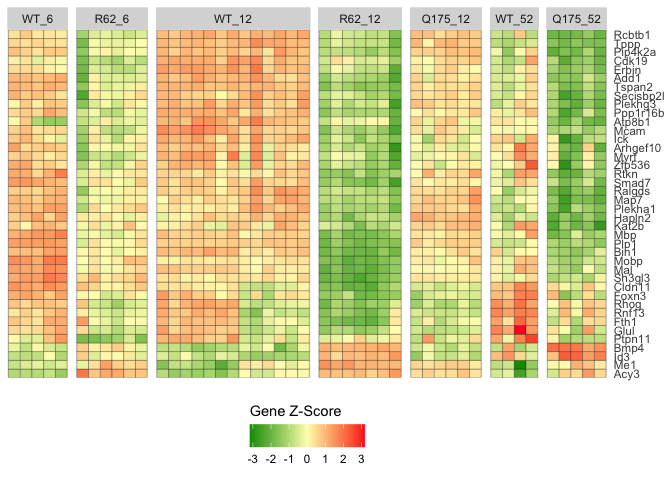<!-- -->

``` r
annotationsFigS6 <- data.frame(row.names = levels(figS6HM$external_gene_name))
annotationsFigS6$Q175_1Yr <- ifelse(row.names(annotationsFigS6) %in% de1YQ175_res$external_gene_name,"Q175_1Yr","NS")
annotationsFigS6$R62_12Wk <- ifelse(row.names(annotationsFigS6) %in% de12WkR62_res$external_gene_name,"R62_12Wk","NS")
annotationsFigS6$R62_6Wk <- ifelse(row.names(annotationsFigS6) %in% de6WkR62_res$external_gene_name,"R62_6Wk","NS")

annotationsFigS6$R62_6Wk <- factor(annotationsFigS6$R62_6Wk)
annotationsFigS6$R62_12Wk <- factor(annotationsFigS6$R62_12Wk)
annotationsFigS6$Q175_1Yr <- factor(annotationsFigS6$Q175_1Yr)


annotationsFigS6$external_gene_name <- row.names(annotationsFigS6)

annotationsFigS6 <- annotationsFigS6 %>%
  pivot_longer(-external_gene_name, names_to = "Sample", values_to = "Group")

annotationsFigS6$external_gene_name <- factor(annotationsFigS6$external_gene_name, levels = figS6HMorder)
annotationsFigS6$Sample <- factor(annotationsFigS6$Sample, levels = c("R62_6Wk", "R62_12Wk", "Q175_1Yr"))
annotationsFigS6$Group <- factor(annotationsFigS6$Group, levels = c("NS", "R62_6Wk", "R62_12Wk",  "Q175_1Yr"))

annotationsFigS6HM <- ggplot(annotationsFigS6, aes(Sample, external_gene_name)) + geom_tile(aes(fill = Group), colour = "black") +
  scale_fill_manual(values=c("white", "orange", "red", "purple")) + scale_x_discrete(expand = c(0, 0)) + theme(axis.title.y = element_blank(), axis.title.x = element_blank(), axis.ticks.x = element_blank(), legend.position = "bottom", axis.ticks.y = element_blank(), axis.text.y = element_blank(), axis.text.x = element_text(angle = 45))


figS6Combined <- (figS6HMgg | annotationsFigS6HM)  + plot_layout(widths = c(1,.15))
figS6Combined
```

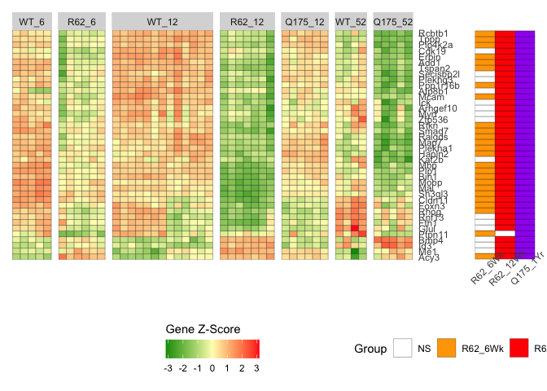<!-- -->

``` r
#ggsave(plot = figS6Combined, filename = "figures/figS6HM.pdf", height = 8, width = 8, units = "in")
```

### Tissue Mass Spec

``` r
tissue <- read.csv("mass_spec/tissueMassSpec.csv")


tissue[is.na(tissue)] <- 0

massSpecTissuePCA <- prcomp(t(tissue[,c(14:29)]), scale = T)


massSpecTissuePCAsamples <- data.frame(Sample = names(tissue[14:29]), Strain = c(rep("R62 12WK",4), rep("WT 12WK",4), rep("zQ175 1YR", 4), rep("WT 1YR",4)))

tissuePCA <- autoplot(massSpecTissuePCA, data = massSpecTissuePCAsamples, label = F, variance_percentage = T, colour = "Strain", size = 6, frame = T) + theme_bw() + ylim(c(-.75,.5)) + xlim(-.5,.25)  +
  scale_fill_manual(values = c("#FF0000","#5B5B5B","#A020F0", "#0E6818")) + scale_color_manual(values = c("#FF0000","#5B5B5B","#A020F0", "#0E6818")) #+ theme(legend.position = "none")
```

    ## Warning: `group_by_()` was deprecated in dplyr 0.7.0.
    ## Please use `group_by()` instead.
    ## See vignette('programming') for more help

``` r
tissuePCA <- tissuePCA + theme(legend.position = "none")
tissuePCA
```

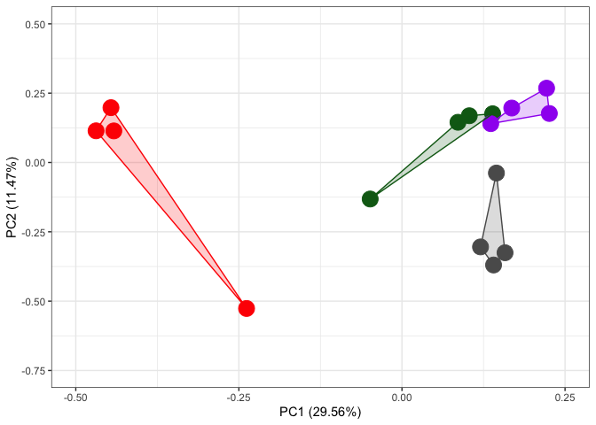<!-- -->

``` r
tissueQ175sig <- tissue[tissue$Q175.WTQ < 0.05,]
tissueR62sig <- tissue[tissue$R62.WTR < 0.05,]


#write.table(tissueQ175sig, file = "tissueQ175sig.txt", sep = "\t", quote = F, row.names = F)
#write.table(tissueR62sig, file = "tissueR62sig.txt", sep = "\t", quote = F, row.names = F)

### Venn
VennTissueGG <- ggVennDiagram(list(R62_12Wk = tissueR62sig$Accession, zQ175_1Yr = tissueQ175sig$Accession), label = "count") + theme(legend.position = "none")
VennTissueGG
```

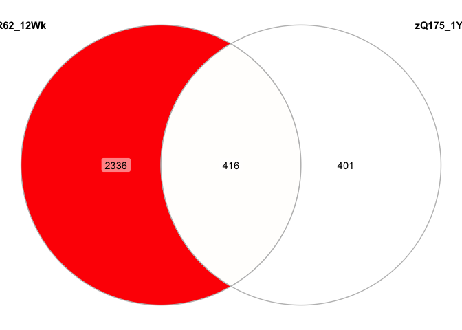<!-- -->

``` r
multiProtein <- tissue[grepl(";", tissue$Genes),]
tissue <-tissue[!grepl(";", tissue$Accession),]


#### Volcanos
massSpecTissueProteins <- c("Ugt8", "Fasn", "Mog", "Pllp", "Apoe", "Htt", "Gsn", "Ermn", "Cnp", "Plp1", "Mag", "Mobp", "Padi2", "Aspa", "Lpar1", "Omg", "Fa2h", "Gpr37", "Sirt2", "Cd9",
                            "Opalin", "Chd3", "Ifit3", "Tmem35a", "Prkg1", "Mbp", "Tf", "Tmem35a", "Abhd13", "Poglut3", "Antkmt", "Eif2ak2", "Fbln5", "Cyb561d2", "Tbl1xr1", "Crabp1")

massSpecTissueProteinsR62 <- massSpecTissueProteins[massSpecTissueProteins %in% tissueR62sig$Genes]


tissueR62Volcano <- EnhancedVolcano(tissue,
                                 lab = as.character(tissue$Genes),
                                 x = "R62.WTR_lfc",
                                 y = "R62.WTR",
                                 pCutoff = 0.05,
                                 FCcutoff = 0,
                                 selectLab = massSpecTissueProteinsR62,
                                 drawConnectors = T,
                                 boxedLabels = T,
                                 pointSize = 1,
                                 title = NULL,
                                 subtitle = NULL,
                                 caption = NULL,
                                 xlim =c(-2.4,2.1),
                                 ylim = c(0,6.5),
                                 colAlpha = 1,
                                 col = c("black", "black","black", "#FF0000")) + theme(legend.position  = "none")

tissueR62Volcano
```

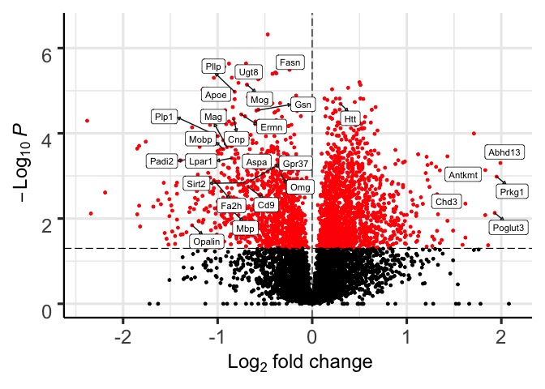<!-- -->

``` r
massSpecTissueProteinsQ175 <- massSpecTissueProteins[massSpecTissueProteins %in% tissueQ175sig$Genes]


tissueQ175Volcano <- EnhancedVolcano(tissue,
                                                 lab = as.character(tissue$Genes),
                                                                  x = "Q175.WTQ_lfc",
                                                                  y = "Q175.WTQ",
                                                                  pCutoff = 0.05,
                                                                  FCcutoff = 0,
                                                                  selectLab = massSpecTissueProteinsQ175,
                                                                  drawConnectors = T,
                                                                  boxedLabels = T,
                                                                  pointSize = 1,
                                                                  title = NULL,
                                                                  subtitle = NULL,
                                                                  caption = NULL,
                                                                  xlim =c(-2.4,2.1),
                                                                  ylim = c(0,6.5),
                                                                  colAlpha = 1,
                                                                  col = c("black", "black","black", "#A020F0")) + theme(legend.position  = "none")

tissueQ175Volcano
```

<!-- -->

``` r
((tissuePCA / plot_spacer()) + plot_layout(height = c(3,1))) | tissueR62Volcano | tissueQ175Volcano
```

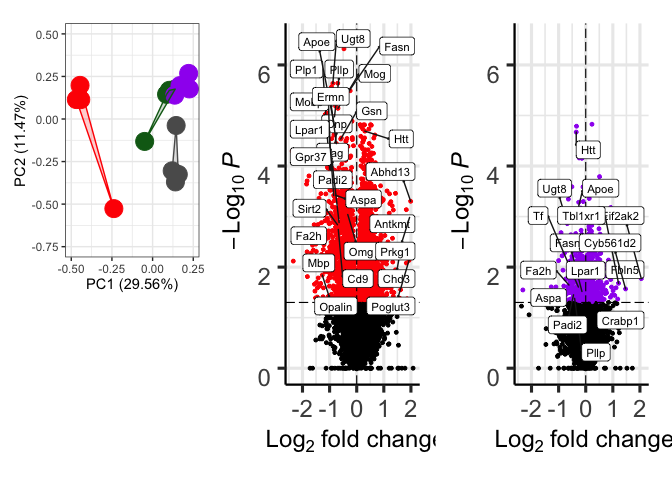<!-- -->

``` r
#ggsave(filename = "tissueTopFigure.pdf", useDingbats = F, width = 12, height = 6)

#### HM
massSpecTissueProteins <- c("Ugt8", "Fasn", "Mog", "Pllp", "Apoe", "Htt", "Gsn", "Ermn", "Cnp", "Plp1", "Mag", "Mobp", "Padi2", "Aspa", "Lpar1", "Omg", "Fa2h", "Gpr37", "Sirt2", "Cd9",
                            "Opalin", "Chd3", "Ifit3", "Tmem35a", "Prkg1", "Mbp", "Tf", "Tmem35a", "Abhd13", "Poglut3", "Antkmt", "Eif2ak2", "Fbln5", "Cyb561d2", "Tbl1xr1", "Crabp1")

tissueHM <- tissue[tissue$Genes %in% massSpecTissueProteins,]
tissueHM <- tissueHM[,c(2,14:29)]
row.names(tissueHM) <- tissueHM$Genes
tissueHM$Genes <- NULL

scale_rows = function(x){
  m = apply(x, 1, mean, na.rm = T)
  s = apply(x, 1, sd, na.rm = T)
  return((x - m) / s)
}

hCluster <- function(genes){
  temp <- scale_rows(genes)
  rowclust = hclust(dist(temp))
  temp = temp[rowclust$order,]
  return(as.data.frame(temp))
}

tissueHM <- as.data.frame(hCluster(tissueHM))
tissueHM$Genes <- row.names(tissueHM)
tissueHM$Genes <- factor(tissueHM$Genes, levels = tissueHM$Genes)


tissueHM <-  tissueHM %>%
  pivot_longer(names_to = "Sample", values_to = "Abundance", cols = c("X20", "X21", "X22", "X23", "X24", "X25", "X26", "X27","X28", "X29", "X30", "X31", "X32", "X33", "X34", "X35"))


tissueHM$group <- mapvalues(tissueHM$Sample,massSpecTissuePCAsamples$Sample, as.character(massSpecTissuePCAsamples$Strain))

tissueHM$group <- factor(tissueHM$group, levels = c("WT 12WK", "R62 12WK", "WT 1YR", "zQ175 1YR"))


tissueHMgg <- ggplot(tissueHM, aes(x = Sample, y = Genes, fill = Abundance)) + geom_tile() + scale_fill_gradientn(colours = c("#009900","#fffcbd","#ff2020"), guide = guide_colourbar(direction = "horizontal", title = "Gene Z-Score", title.position = "top")) + scale_y_discrete(expand = c(0, 0), position = "left")+ facet_grid(cols = vars(group), scales = "free", space = "free", switch = "x") + theme(axis.text.x = element_blank(), axis.ticks.x = element_blank(), legend.position = "bottom", legend.direction = "horizontal", axis.title.y = element_blank(), axis.title.x = element_blank(), axis.ticks.y  = element_blank())
tissueHMgg
```

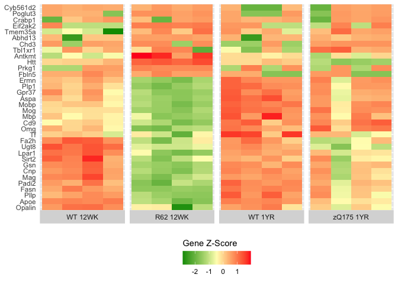<!-- -->

``` r
#### Both IPA
#### IPA
files <- paste0("mass_spec/",c("R62_tissue_mass_IPA.txt", "Q175_tissue_mass_IPA.txt"))
compNames <- c("R62 12WK", "zQ175 1YR")

for(i in 1:length(files)){
  canonicalIPA <- fread(files[i], skip = 25,drop = c(4,6))
  names(canonicalIPA) <- c("Pathway", "pVal", "zScore", "Genes")
  canonicalIPA$type <- "Canonical"
  upstreamIPA <- fread(files[i], skip = 25+nrow(canonicalIPA), drop = c(1:2,4:6,8:10,13:14))
  upstreamIPA <- upstreamIPA[,c(1,3,2,4)]
  names(upstreamIPA) <- c("Pathway", "pVal", "zScore", "Genes")
  upstreamIPA$Pathway <- paste0(upstreamIPA$Pathway, " Signaling")
  upstreamIPA$pVal <- -log10(upstreamIPA$pVal)
  upstreamIPA$type <- "Upstream"
  functionalIPA <- fread(files[i], skip = "Diseases and Bio", drop = c(1,2,5,7,8,10,11))
  names(functionalIPA) <- c("Pathway", "pVal", "zScore", "Genes")
  functionalIPA$pVal <- -log10(functionalIPA$pVal)
  functionalIPA$type <- "Functional"
  if(i == 1){
    IPA <- rbind(canonicalIPA, upstreamIPA, functionalIPA)
    IPA$comparison <- compNames[i]
  } else {
    tempIPA <- rbind(canonicalIPA, upstreamIPA, functionalIPA)
    tempIPA$comparison <- compNames[i]
    IPA <- rbind(IPA, tempIPA)
  }
}
```

    ## Warning in fread(files[i], skip = 25, drop = c(4, 6)): Detected 5 column names
    ## but the data has 6 columns (i.e. invalid file). Added 1 extra default column
    ## name for the first column which is guessed to be row names or an index. Use
    ## setnames() afterwards if this guess is not correct, or fix the file write
    ## command that created the file to create a valid file.

    ## Warning in fread(files[i], skip = 25, drop = c(4, 6)): Stopped early on line
    ## 665. Expected 6 fields but found 0. Consider fill=TRUE and comment.char=.
    ## First discarded non-empty line: <<Upstream Regulators for My Projects-
    ## >HD_Myelination_Paper->tissueR62sig - 2022-03-03 09:06 PM>>

    ## Warning in fread(files[i], skip = 25 + nrow(canonicalIPA), drop = c(1:2, :
    ## Stopped early on line 1491. Expected 14 fields but found 0. Consider fill=TRUE
    ## and comment.char=. First discarded non-empty line: <<Causal Networks for My
    ## Projects->HD_Myelination_Paper->tissueR62sig - 2022-03-03 09:06 PM>>

    ## Warning in fread(files[i], skip = "Diseases and Bio", drop = c(1, 2, 5, :
    ## Stopped early on line 4410. Expected 11 fields but found 0. Consider fill=TRUE
    ## and comment.char=. First discarded non-empty line: <<Tox Functions for My
    ## Projects->HD_Myelination_Paper->tissueR62sig - 2022-03-03 09:06 PM>>

    ## Warning in fread(files[i], skip = 25, drop = c(4, 6)): Detected 5 column names
    ## but the data has 6 columns (i.e. invalid file). Added 1 extra default column
    ## name for the first column which is guessed to be row names or an index. Use
    ## setnames() afterwards if this guess is not correct, or fix the file write
    ## command that created the file to create a valid file.

    ## Warning in fread(files[i], skip = 25, drop = c(4, 6)): Stopped early on line
    ## 548. Expected 6 fields but found 0. Consider fill=TRUE and comment.char=.
    ## First discarded non-empty line: <<Upstream Regulators for My Projects-
    ## >HD_Myelination_Paper->tissueQ175sig - 2022-03-03 08:59 PM>>

    ## Warning in fread(files[i], skip = 25 + nrow(canonicalIPA), drop = c(1:2, :
    ## Stopped early on line 1036. Expected 14 fields but found 0. Consider fill=TRUE
    ## and comment.char=. First discarded non-empty line: <<Causal Networks for My
    ## Projects->HD_Myelination_Paper->tissueQ175sig - 2022-03-03 08:59 PM>>

    ## Warning in fread(files[i], skip = "Diseases and Bio", drop = c(1, 2, 5, :
    ## Stopped early on line 3473. Expected 11 fields but found 0. Consider fill=TRUE
    ## and comment.char=. First discarded non-empty line: <<Tox Functions for My
    ## Projects->HD_Myelination_Paper->tissueQ175sig - 2022-03-03 08:59 PM>>

``` r
rm(canonicalIPA)
rm(upstreamIPA)
rm(functionalIPA)

IPA[is.na(IPA$zScore)]$zScore <- 0
ogIPA <- IPA
IPA <- IPA[IPA$pVal > -log10(0.01),]


tissueIPAterms <- c("TCF7L2 Signaling", "HTT Signaling", "Motor dysfunction or movement disorder", "Synthesis of lipid", "Metabolism of membrane lipid derivative", 
                    "Neurodegeneration", "Sphingosine-1-phosphate Signaling",  "Ceramide Signaling", "Translation of RNA", "BDNF Signaling", "Neuregulin Signaling",
                    "PTEN Signaling", "AMPK Signaling", "CREB1 Signaling", "Transport of metal ion")

tissueIPAfiltered <- IPA[IPA$Pathway %in% tissueIPAterms,]
tissueIPAfiltered <- tissueIPAfiltered[order(tissueIPAfiltered$zScore),]
tissueIPAfiltered <- tissueIPAfiltered[-17,]
tissueIPAfiltered$Pathway <- factor(tissueIPAfiltered$Pathway, levels = unique(tissueIPAfiltered$Pathway))


tissueIPA <- ggplot(tissueIPAfiltered, aes(x = comparison, y = Pathway, colour = zScore)) + geom_point(aes(size  = pVal)) + scale_color_gradientn(colours = c("#2E30FF", "grey", "red"), values = scales::rescale(c(-.5,.55,.9)), guide = guide_colourbar(direction = "horizontal", title = "Activation Z-Score", title.position = "top"))  + scale_y_discrete(labels = function(Pathway) str_wrap(Pathway, width = 20)) + theme_bw() + theme(legend.position = "bottom") +
  scale_size_continuous(range=c(2, 10))
tissueIPA
```

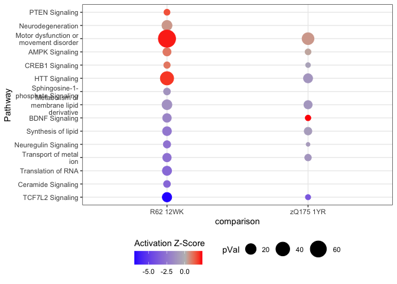<!-- -->

``` r
(tissueHMgg | tissueIPA) + plot_layout(width = c(2,1))
```

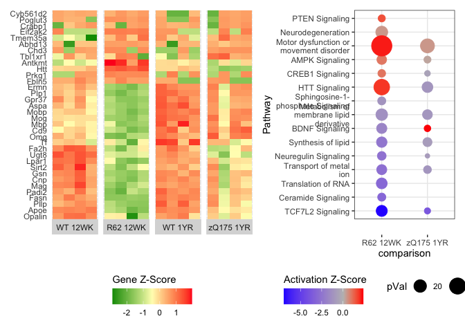<!-- -->

``` r
#ggsave(filename = "bottomMassSpec.pdf", width = 12,height = 6)

# Annotations
annotationsTissue <- data.frame(row.names = levels(tissueHM$Genes))
annotationsTissue$Q175_1Yr <- ifelse(row.names(annotationsTissue) %in% tissueQ175sig$Genes,"Q175_1Yr","NS")
annotationsTissue$R62_12Wk <- ifelse(row.names(annotationsTissue) %in% tissueR62sig$Genes,"R62_12Wk","NS")

annotationsTissue$Q175_1Yr <- factor(annotationsTissue$Q175_1Yr)
annotationsTissue$R62_12Wk <- factor(annotationsTissue$R62_12Wk)


annotationsTissue$external_gene_name <- row.names(annotationsTissue)

annotationsTissue <- annotationsTissue %>%
  pivot_longer(-external_gene_name, names_to = "Sample", values_to = "Group")


annotationsTissue$external_gene_name <- factor(annotationsTissue$external_gene_name, levels = levels(tissueHM$Genes))
annotationsTissue$Sample <- factor(annotationsTissue$Sample, levels = c("R62_12Wk", "Q175_1Yr"))
annotationsTissue$Group <- factor(annotationsTissue$Group, levels = c("NS", "R62_12Wk",  "Q175_1Yr"))

annotationsTissueHM <- ggplot(annotationsTissue, aes(Sample, external_gene_name)) + geom_tile(aes(fill = Group), colour = "black") +
  scale_fill_manual(values=c("white", "red", "purple")) + scale_x_discrete(expand = c(0, 0)) + theme(axis.title.y = element_blank(), axis.title.x = element_blank(), axis.ticks.x = element_blank(), legend.position = "bottom", axis.ticks.y = element_blank(), axis.text.y = element_blank(), axis.text.x = element_text(angle = 45))

annotationsTissueHM
```

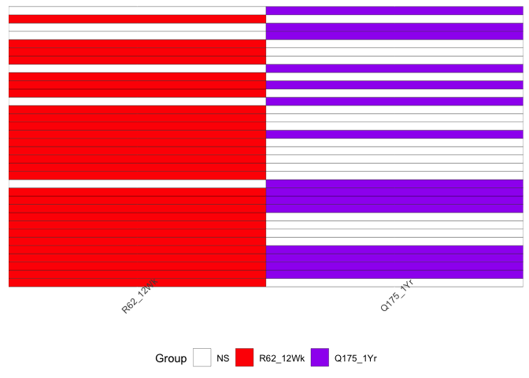<!-- -->

``` r
#ggsave(filename = "tissueAnnotations.pdf", width = 3, height = 12)
```

### R6/2 A2B5 Mass Spec

``` r
r62 <- read.csv("mass_spec/Mariani_MouseExp2NormalizedSummedAbundance_22-034.csv")
r62[is.na(r62)] <- 0

r62$gene <- gsub(x = gsub(x = r62$Description, ".*GN=", replacement = ""), " .*", replacement = "")

r62$gene <- capitalize(tolower(r62$gene))


massSpecPCA <- prcomp(t(r62[,c(26:31)]), scale = T)
massSpecPCAsamples <- data.frame(Sample = names(r62[26:31]), Strain = c(rep("WT",3), rep("R6/2",3)))

a2b5PCA <- autoplot(massSpecPCA, data = massSpecPCAsamples, label = F, variance_percentage = T, colour = "Strain", size = 8, frame = T) + theme_bw() + ylim(c(-1,1)) + xlim(-.6,.6) + theme(legend.position = "none")
a2b5PCA
```

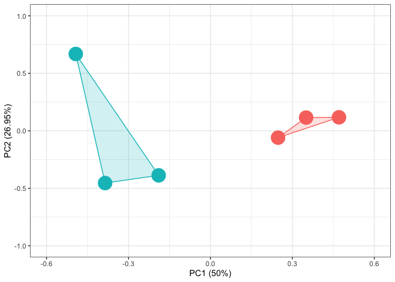<!-- -->

``` r
filteredGenes <- r62[r62$gene %not in% de12WkR62_all$external_gene_name,]$gene
sigGenes <- r62[r62$gene %in% de12WkR62_res$external_gene_name & r62$P.Value < 0.05,]$gene


keyvals <- ifelse(r62$gene %in% sigGenes, "Red2",
                  ifelse(r62$gene %not in% filteredGenes, "Black",
                         "Grey"))


names(keyvals)[keyvals == "Grey"] <- "Low RNA-Seq Expression"
names(keyvals)[keyvals == "Red2"] <- "Significant in 12 Wk R6/2 RNA-Seq"
names(keyvals)[keyvals == "Black"] <- "N.S. in 12 Wk R6/2 RNA-Seq"

labelGenes <- sigGenes[sigGenes %not in% filteredGenes]

labelGenesVolcano <- c("Eno3", "Clu", "Enpp2", "Emc3", "Mtmr2", "Hmgb1", "Ahcyl1", "Mobp", "Fasn", "Ndrg1", "Uchl1", "Tomm34", "Rhot1", "Plekhb1", "Rab5b", "Rtn3", "Marcks", "Arsa", "Pfkm", "Hebp1", "S100b", "Ptgds", "Tceal3", "Dnm3", "Ssrp1", "Ktn1", "Apeh", "Vat1", "Ptma")


a2b5Volcano <- EnhancedVolcano(r62,
                lab = r62$gene,
                x = "Abundance.Ratio..log2....R62.....WTR.",
                y = 'P.Value',
                pCutoff = 0.05,
                FCcutoff = 0,
                colCustom = keyvals,
                selectLab = labelGenesVolcano,
                drawConnectors = T,
                boxedLabels = T)


r62sig <- r62[r62$P.Value < 0.05,]

r62sigMerge <- merge(r62sig, de12WkR62_all, by.x = "gene", by.y = "external_gene_name")

r62sigMergeSig <- r62sigMerge[r62sigMerge$padj < 0.01,]


scatterPlotA2B5 <- ggplot(r62sigMergeSig, aes(x = Abundance.Ratio..log2....R62.....WTR., y= log2FoldChange)) + geom_point(colour = "Red") + geom_text_repel(aes(label = gene)) +ylab("Log2 Fold Change - RNA-Seq") + xlab("Log2 Fold Change - Mass Spec") + theme_bw() + ggtitle ("R62 - 12 Weeks") + ylim(c(-2,4)) + geom_hline(yintercept = 0) + geom_vline(xintercept = 0)

scatterPlotA2B5
```

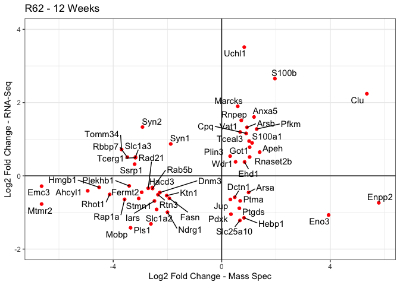<!-- -->

``` r
a2b5PCA | a2b5Volcano | scatterPlotA2B5
```

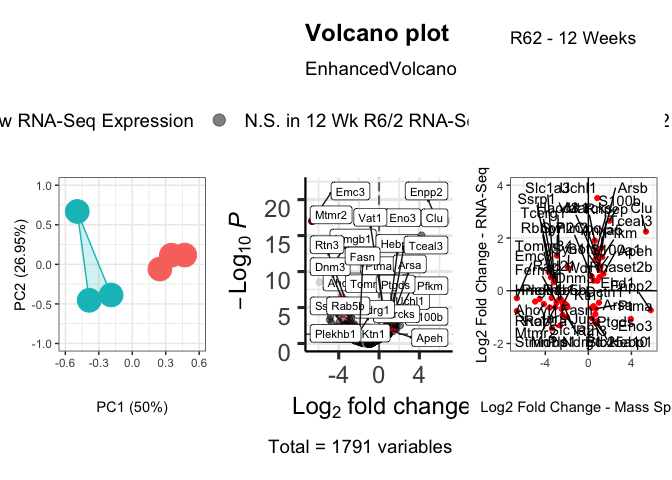<!-- -->

``` r
#ggsave(filename = "a2b5_mass_spec_figure.pdf", width = 15, height = 7)
```
